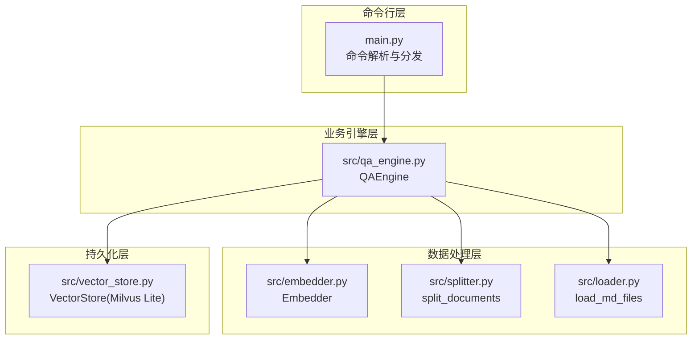
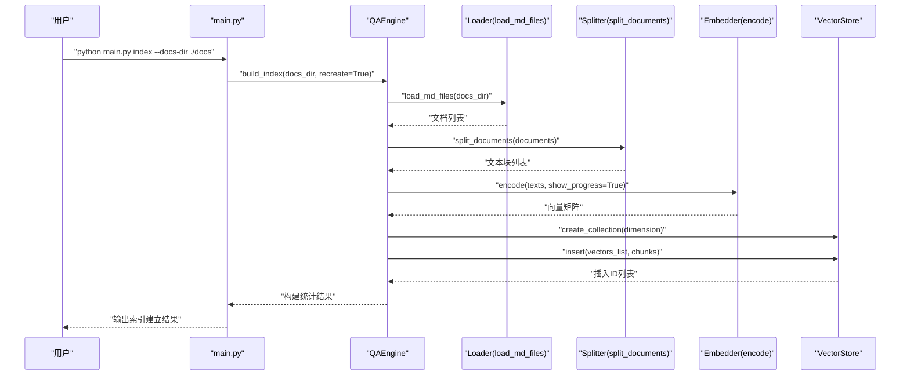
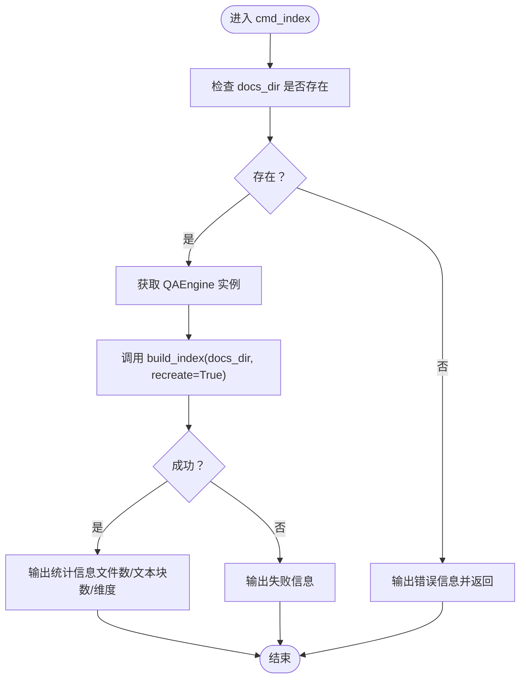
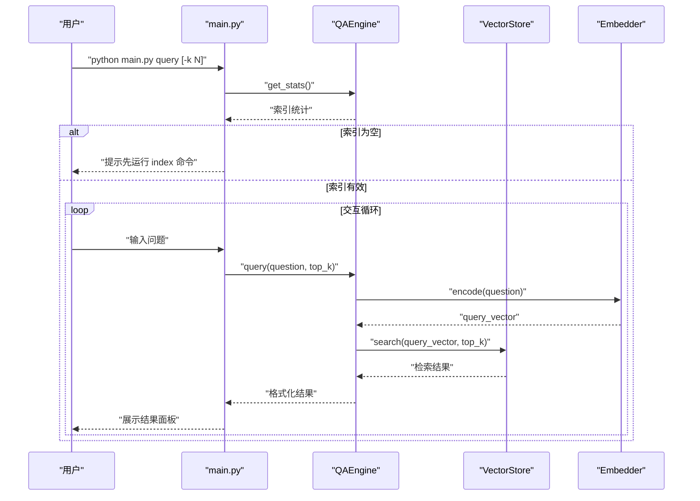
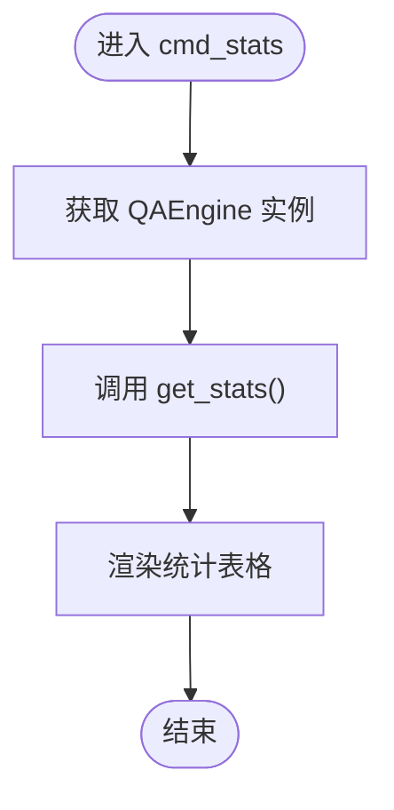
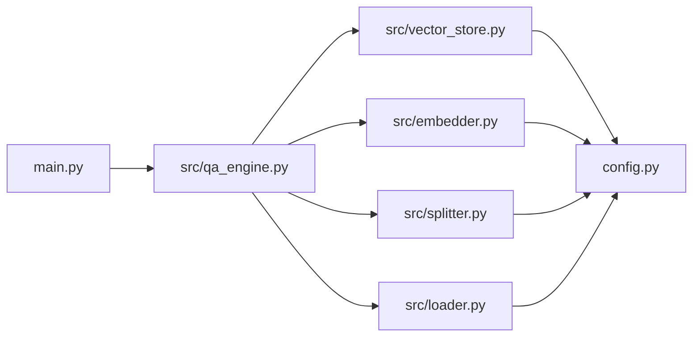

# 命令行界面

<cite>
**本文引用的文件**
- [main.py](file://main.py)
- [config.py](file://config.py)
- [src/qa_engine.py](file://src/qa_engine.py)
- [src/vector_store.py](file://src/vector_store.py)
- [src/embedder.py](file://src/embedder.py)
- [src/loader.py](file://src/loader.py)
- [src/splitter.py](file://src/splitter.py)
- [requirements.txt](file://requirements.txt)
- [docs/docker-guide.md](file://docs/docker-guide.md)
- [docs/git-guide.md](file://docs/git-guide.md)
</cite>

## 目录
1. [简介](#简介)
2. [项目结构](#项目结构)
3. [核心组件](#核心组件)
4. [架构总览](#架构总览)
5. [详细组件分析](#详细组件分析)
6. [依赖关系分析](#依赖关系分析)
7. [性能考虑](#性能考虑)
8. [故障排除指南](#故障排除指南)
9. [结论](#结论)
10. [附录](#附录)

## 简介
本文件面向命令行界面（CLI）的使用者，系统性地介绍三个主要子命令：index（索引建立）、query（问答查询）和 stats（统计信息）。文档覆盖参数选项、使用方法、执行流程、输出格式、错误处理、故障排除、与其他模块的集成关系、最佳实践与性能优化建议，并提供从基础到高级的丰富示例，帮助新用户快速上手，同时满足高级用户的深度需求。

## 项目结构
命令行入口位于主程序文件，通过子命令分发到具体处理逻辑；核心检索能力由问答引擎封装，底层依赖嵌入模型、文本分割、文档加载与向量存储（Milvus Lite）等模块。

图表来源
- [main.py](file://main.py#L142-L190)
- [src/qa_engine.py](file://src/qa_engine.py#L13-L101)
- [src/embedder.py](file://src/embedder.py#L11-L86)
- [src/splitter.py](file://src/splitter.py#L88-L126)
- [src/loader.py](file://src/loader.py#L10-L57)
- [src/vector_store.py](file://src/vector_store.py#L10-L172)

章节来源
- [main.py](file://main.py#L142-L190)
- [config.py](file://config.py#L1-L24)

## 核心组件
- 命令行入口与子命令分发：负责解析参数、打印帮助、调用对应命令处理函数。
- 问答引擎（QAEngine）：封装索引构建与查询流程，协调嵌入编码、文本分割、文档加载与向量存储。
- 向量存储（VectorStore）：基于 Milvus Lite 的本地向量数据库，提供集合管理、插入、搜索与统计。
- 嵌入模型（Embedder）：封装本地 SentenceTransformer 模型，提供文本编码与维度查询。
- 文档加载与分割：递归扫描 Markdown 文档，按标题与长度进行智能分块。

章节来源
- [main.py](file://main.py#L24-L140)
- [src/qa_engine.py](file://src/qa_engine.py#L13-L101)
- [src/vector_store.py](file://src/vector_store.py#L10-L172)
- [src/embedder.py](file://src/embedder.py#L11-L86)
- [src/loader.py](file://src/loader.py#L10-L57)
- [src/splitter.py](file://src/splitter.py#L88-L126)

## 架构总览
下图展示 CLI 与各模块的交互关系及数据流。

图表来源
- [main.py](file://main.py#L24-L52)
- [src/qa_engine.py](file://src/qa_engine.py#L25-L73)
- [src/loader.py](file://src/loader.py#L10-L38)
- [src/splitter.py](file://src/splitter.py#L88-L126)
- [src/embedder.py](file://src/embedder.py#L36-L58)
- [src/vector_store.py](file://src/vector_store.py#L35-L93)

## 详细组件分析

### index 命令（索引建立）
- 目标：扫描指定目录下的 Markdown 文档，构建本地向量索引。
- 参数
  - --docs-dir/-d：文档目录路径，默认 ./docs
- 执行流程
  1) 校验目录存在性
  2) 获取全局 QA 引擎实例
  3) 调用 build_index(docs_dir, recreate=True)
  4) 输出统计信息（文件数、文本块数、向量维度）
- 输出格式
  - 成功：以面板形式输出“索引建立成功”，包含文件数、文本块数、向量维度
  - 失败：输出红色错误信息，包含失败原因
- 错误处理
  - 目录不存在：直接报错并退出
  - 未找到 md 文件：返回失败并提示
- 性能与优化
  - 文本分块大小与重叠影响索引规模与召回质量，详见配置项
  - 嵌入模型首次加载会耗时，后续复用缓存
- 使用示例
  - 基础用法：python main.py index
  - 指定目录：python main.py index --docs-dir ./docs
  - 指定目录（短参）：python main.py index -d ./docs

图表来源
- [main.py](file://main.py#L24-L52)
- [src/qa_engine.py](file://src/qa_engine.py#L25-L73)

章节来源
- [main.py](file://main.py#L24-L52)
- [src/qa_engine.py](file://src/qa_engine.py#L25-L73)

### query 命令（问答查询）
- 目标：在已有索引基础上进行语义检索问答。
- 参数
  - --top-k/-k：返回结果数量，默认来自配置
- 执行流程
  1) 获取全局 QA 引擎实例
  2) 检查索引是否存在且非空
  3) 进入交互循环，逐条接收问题
  4) 编码问题为向量并执行相似度搜索
  5) 格式化并展示结果（含相似度、来源、截断文本）
  6) 支持 q/quit/exit 退出
- 输出格式
  - 面板展示每条结果，包含相似度分数、来源文件、截断文本
  - 未找到结果时提示“未找到相关结果”
- 错误处理
  - 索引为空：提示先运行 index 命令
  - 键盘中断：优雅退出
  - 其他异常：输出错误信息
- 使用示例
  - 基础用法：python main.py query
  - 指定返回数量：python main.py query --top-k 10
  - 指定返回数量（短参）：python main.py query -k 3

图表来源
- [main.py](file://main.py#L54-L123)
- [src/qa_engine.py](file://src/qa_engine.py#L75-L92)
- [src/embedder.py](file://src/embedder.py#L36-L58)
- [src/vector_store.py](file://src/vector_store.py#L95-L128)

章节来源
- [main.py](file://main.py#L54-L123)
- [src/qa_engine.py](file://src/qa_engine.py#L75-L92)

### stats 命令（统计信息）
- 目标：查看当前知识库索引状态与文档块数量。
- 参数：无
- 输出格式：表格形式，包含“索引状态”和“文档块数量”
- 使用示例
  - 基础用法：python main.py stats

图表来源
- [main.py](file://main.py#L125-L139)
- [src/qa_engine.py](file://src/qa_engine.py#L94-L101)

章节来源
- [main.py](file://main.py#L125-L139)
- [src/qa_engine.py](file://src/qa_engine.py#L94-L101)

## 依赖关系分析
- CLI 依赖 QAEngine 提供的构建与查询能力
- QAEngine 依赖 Embedder、Splitter、Loader、VectorStore
- VectorStore 依赖 Milvus Lite 客户端
- 配置文件集中管理嵌入模型、向量维度、Milvus 路径、集合名、分块策略与默认返回数量

图表来源
- [main.py](file://main.py#L17-L18)
- [src/qa_engine.py](file://src/qa_engine.py#L6-L10)
- [src/vector_store.py](file://src/vector_store.py#L7)
- [config.py](file://config.py#L1-L24)

章节来源
- [main.py](file://main.py#L17-L18)
- [src/qa_engine.py](file://src/qa_engine.py#L6-L10)
- [src/vector_store.py](file://src/vector_store.py#L7)
- [config.py](file://config.py#L1-L24)

## 性能考虑
- 嵌入模型加载与编码
  - 首次加载模型会有延迟，建议在构建索引后保持进程运行以复用模型
  - 编码时可开启进度条，便于观察大规模文本处理进度
- 文本分块策略
  - CHUNK_SIZE 与 CHUNK_OVERLAP 影响召回质量与索引规模，建议根据文档特性调整
  - 按标题优先分割有助于保留上下文完整性
- 向量维度与相似度
  - 向量维度越高，表达能力越强但内存与计算成本越高
  - Milvus 使用余弦相似度，距离越小相似度越高
- 返回数量（top-k）
  - 较大的 top-k 会增加展示与排序开销，建议结合实际需求设置
- I/O 与磁盘
  - Milvus Lite 将索引写入本地文件，确保磁盘空间充足，避免频繁 I/O 抖动

章节来源
- [src/embedder.py](file://src/embedder.py#L26-L58)
- [src/splitter.py](file://src/splitter.py#L47-L85)
- [src/vector_store.py](file://src/vector_store.py#L55-L60)
- [config.py](file://config.py#L18-L23)

## 故障排除指南
- 索引为空或未建立
  - 现象：query 命令提示索引为空
  - 处理：先运行 index 命令建立索引
- 目录不存在
  - 现象：index 命令报错“目录不存在”
  - 处理：确认 --docs-dir 指向存在的目录
- 未找到 md 文件
  - 现象：index 命令返回“未找到任何 md 文件”
  - 处理：检查目录内是否包含 .md 文件，或修正目录路径
- 模型加载失败
  - 现象：首次编码时报错
  - 处理：确保网络可访问模型仓库，或提前下载模型至本地缓存
- Milvus Lite 写入失败
  - 现象：索引构建卡在插入阶段
  - 处理：检查磁盘空间、权限与路径有效性
- 查询异常
  - 现象：query 循环中出现异常
  - 处理：捕获异常并输出错误信息，必要时重启进程

章节来源
- [main.py](file://main.py#L30-L32)
- [main.py](file://main.py#L62-L65)
- [src/qa_engine.py](file://src/qa_engine.py#L42-L43)
- [src/embedder.py](file://src/embedder.py#L30-L34)
- [src/vector_store.py](file://src/vector_store.py#L87-L93)

## 结论
命令行界面提供了简洁高效的本地语义检索知识库工具链：index 用于构建索引，query 用于交互式问答，stats 用于查看状态。通过合理的配置与分块策略，可在保证检索质量的同时兼顾性能与稳定性。建议在生产环境中结合持续集成与增量更新策略，以维持索引的时效性与准确性。

## 附录

### 参数与默认值速览
- index
  - --docs-dir/-d：默认 ./docs
- query
  - --top-k/-k：默认来自配置
- stats：无参数

章节来源
- [main.py](file://main.py#L160-L178)
- [config.py](file://config.py#L23)

### 使用示例清单
- 建立索引
  - python main.py index
  - python main.py index --docs-dir ./docs
  - python main.py index -d ./docs
- 问答查询
  - python main.py query
  - python main.py query --top-k 10
  - python main.py query -k 3
- 查看统计
  - python main.py stats

章节来源
- [main.py](file://main.py#L149-L154)

### 与示例文档的集成
- 可将 docs 目录替换为实际文档集合，如将示例文档加入后重新构建索引
- 示例文档可用于验证索引构建与查询流程

章节来源
- [docs/docker-guide.md](file://docs/docker-guide.md#L1-L184)
- [docs/git-guide.md](file://docs/git-guide.md#L1-L151)