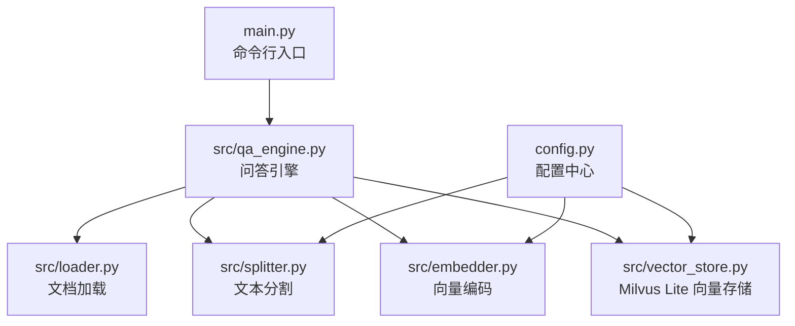
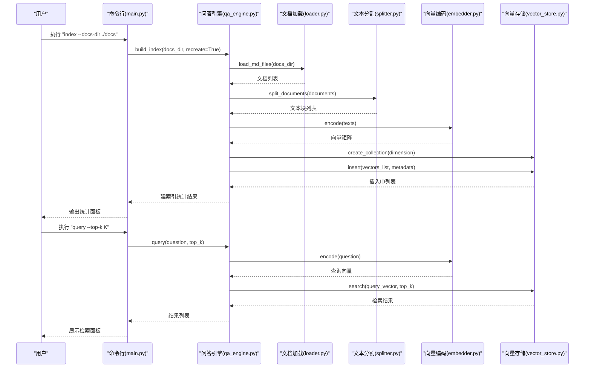
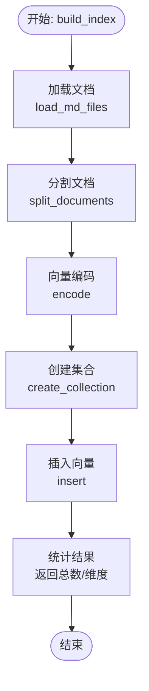
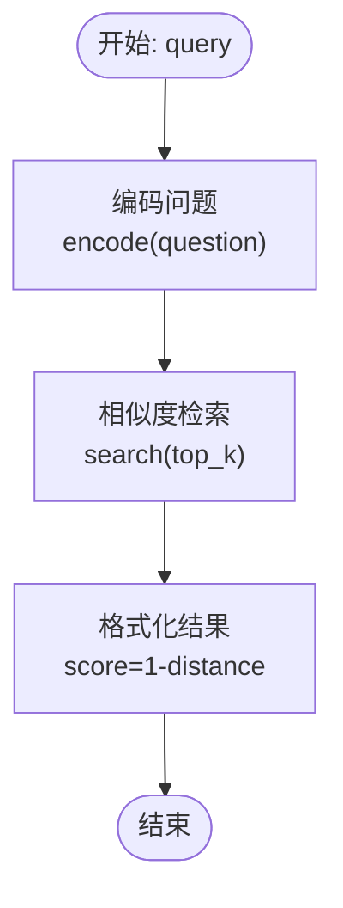
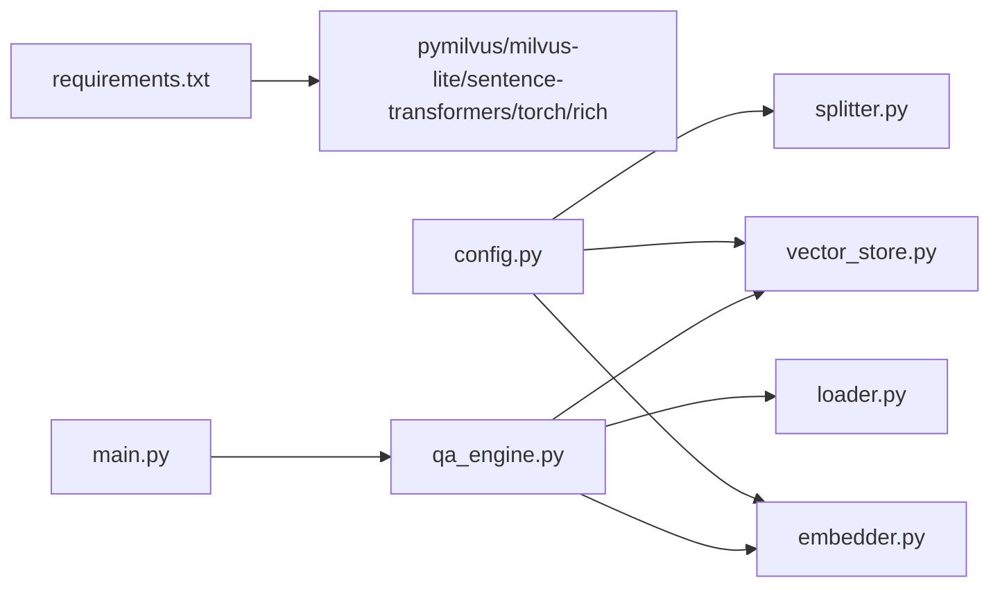

# 快速开始

<cite>
**本文引用的文件**
- [requirements.txt](file://requirements.txt)
- [config.py](file://config.py)
- [main.py](file://main.py)
- [src/qa_engine.py](file://src/qa_engine.py)
- [src/embedder.py](file://src/embedder.py)
- [src/splitter.py](file://src/splitter.py)
- [src/loader.py](file://src/loader.py)
- [src/vector_store.py](file://src/vector_store.py)
- [docs/python-guide.md](file://docs/python-guide.md)
- [docs/docker-guide.md](file://docs/docker-guide.md)
- [docs/git-guide.md](file://docs/git-guide.md)
</cite>

## 目录
1. [简介](#简介)
2. [项目结构](#项目结构)
3. [核心组件](#核心组件)
4. [架构总览](#架构总览)
5. [详细组件分析](#详细组件分析)
6. [依赖关系分析](#依赖关系分析)
7. [性能考虑](#性能考虑)
8. [故障排除指南](#故障排除指南)
9. [结论](#结论)
10. [附录](#附录)

## 简介
本“快速开始”指南面向初学者，帮助你在最短时间内完成环境准备、依赖安装、配置校验，并通过一个完整的示例体验从文档目录创建、索引建立、查询检索到统计查看的全流程。你将学会如何：
- 准备 Python 环境与依赖
- 配置项目参数
- 建立本地知识库索引
- 进行语义检索问答
- 查看统计信息
- 识别常见问题并进行排障

## 项目结构
该项目采用“命令行入口 + 模块化组件”的组织方式，核心入口为命令行工具，核心能力由嵌入编码、文档加载、文本分割、向量存储与问答引擎等模块协同完成。

图表来源
- [main.py](file://main.py#L142-L194)
- [src/qa_engine.py](file://src/qa_engine.py#L13-L119)
- [src/loader.py](file://src/loader.py#L10-L57)
- [src/splitter.py](file://src/splitter.py#L47-L126)
- [src/embedder.py](file://src/embedder.py#L11-L86)
- [src/vector_store.py](file://src/vector_store.py#L10-L172)
- [config.py](file://config.py#L1-L24)

章节来源
- [main.py](file://main.py#L1-L194)
- [config.py](file://config.py#L1-L24)

## 核心组件
- 命令行入口：提供 index、query、stats 三个子命令，负责解析参数、调用引擎并输出结果。
- 问答引擎：串联加载、分割、编码、入库、检索与统计。
- 文档加载：递归扫描指定目录下的 Markdown 文件。
- 文本分割：按标题与固定长度进行智能分块，保留上下文连续性。
- 向量编码：基于本地模型将文本转为向量。
- 向量存储：基于 Milvus Lite 的本地向量数据库，支持创建集合、插入向量与相似度检索。
- 配置中心：集中管理嵌入模型、向量维度、集合名、分块策略与检索参数等。

章节来源
- [main.py](file://main.py#L24-L140)
- [src/qa_engine.py](file://src/qa_engine.py#L13-L119)
- [src/loader.py](file://src/loader.py#L10-L57)
- [src/splitter.py](file://src/splitter.py#L47-L126)
- [src/embedder.py](file://src/embedder.py#L11-L86)
- [src/vector_store.py](file://src/vector_store.py#L10-L172)
- [config.py](file://config.py#L1-L24)

## 架构总览
下面以“建立索引”和“问答查询”两条主线展示系统交互。

图表来源
- [main.py](file://main.py#L24-L123)
- [src/qa_engine.py](file://src/qa_engine.py#L25-L92)
- [src/loader.py](file://src/loader.py#L10-L38)
- [src/splitter.py](file://src/splitter.py#L88-L126)
- [src/embedder.py](file://src/embedder.py#L36-L58)
- [src/vector_store.py](file://src/vector_store.py#L35-L128)

## 详细组件分析

### 环境与依赖准备
- Python 版本要求：请使用 Python 3.8 或更高版本。若不确定版本，可在终端执行 python --version 或 python3 --version 查看。
- 依赖安装：项目使用 pip 安装依赖，核心依赖包括 Milvus 客户端、Milvus Lite、Sentence Transformers、PyTorch、Rich 等。建议在项目根目录执行 pip install -r requirements.txt 完成安装。
- 依赖安装常见问题：
  - 网络受限导致下载缓慢或失败：可配置国内镜像源，例如使用 pip install -r requirements.txt -i https://pypi.tuna.tsinghua.edu.cn/simple/。
  - PyTorch 与 CUDA 版本不匹配：若系统有 GPU 且希望加速推理，可参考 PyTorch 官方安装指南选择合适版本；若无 GPU，安装 CPU 版本即可。
  - sentence-transformers 模型首次加载会自动下载模型权重：首次运行会较慢，请保持网络稳定。
- 验证安装：
  - 成功后可直接运行命令行入口 python main.py 查看帮助信息，确认命令可用。
  - 运行 python main.py stats 若能显示统计表格，则表示向量存储与配置基本正常。

章节来源
- [requirements.txt](file://requirements.txt#L1-L6)
- [main.py](file://main.py#L142-L194)

### 配置准备
- 嵌入模型与维度：默认使用 moka-ai/m3e-base 模型，向量维度为 768。如需更换模型，可在配置文件中调整。
- Milvus 配置：默认本地数据库路径为 ./data/milvus.db，集合名为 md_knowledge_base。
- 文本分割：默认分块大小为 500 字符，重叠 50 字符；可根据文档体量与查询需求调整。
- 检索参数：默认返回前 5 个结果，可通过命令行 --top-k 覆盖。

章节来源
- [config.py](file://config.py#L1-L24)

### 第一个使用示例：从零到检索
以下为完整示例流程，从创建文档目录开始，演示建立索引、查询与统计查看。

- 步骤 1：准备文档目录
  - 在项目根目录下创建一个 docs 目录，并放入若干 Markdown 文档（例如 docker-guide.md、git-guide.md、python-guide.md）。
  - 确保文档编码为 UTF-8，避免中文乱码。

- 步骤 2：建立索引
  - 在终端执行：python main.py index --docs-dir ./docs
  - 预期结果：
    - 控制台输出“开始建立索引”提示；
    - 显示扫描到的文档数量与总字符数；
    - 输出分块数量、向量维度与插入条目数；
    - 成功后显示“索引建立成功”。

- 步骤 3：查看统计
  - 在终端执行：python main.py stats
  - 预期结果：
    - 输出表格，包含“索引状态”和“文档块数量”，确认索引已建立且数量大于 0。

- 步骤 4：进行问答查询
  - 在终端执行：python main.py query --top-k 5
  - 预期结果：
    - 进入问答模式，提示输入问题；
    - 输入问题后，系统返回相似度最高的若干结果，每个结果包含来源文件、相似度分数与片段文本；
    - 输入 q/quit/exit 退出。

- 步骤 5：常见问题与修正
  - 索引为空：若 stats 显示“索引状态”为未建立或“文档块数量”为 0，请先执行建立索引命令。
  - 文档目录不存在：若提示目录不存在，请检查路径是否正确或先创建 docs 目录。
  - 模型加载缓慢：首次加载嵌入模型会自动下载权重，耐心等待或配置代理/镜像源。

章节来源
- [main.py](file://main.py#L24-L140)
- [src/qa_engine.py](file://src/qa_engine.py#L25-L92)
- [src/loader.py](file://src/loader.py#L10-L38)
- [src/splitter.py](file://src/splitter.py#L88-L126)
- [src/embedder.py](file://src/embedder.py#L26-L58)
- [src/vector_store.py](file://src/vector_store.py#L35-L128)

### 组件内部流程图

#### 建立索引流程

图表来源
- [src/qa_engine.py](file://src/qa_engine.py#L25-L73)
- [src/loader.py](file://src/loader.py#L10-L38)
- [src/splitter.py](file://src/splitter.py#L88-L126)
- [src/embedder.py](file://src/embedder.py#L36-L58)
- [src/vector_store.py](file://src/vector_store.py#L35-L94)

#### 问答查询流程

图表来源
- [src/qa_engine.py](file://src/qa_engine.py#L75-L92)
- [src/embedder.py](file://src/embedder.py#L36-L58)
- [src/vector_store.py](file://src/vector_store.py#L95-L128)

## 依赖关系分析
- 外部依赖：pymilvus、milvus-lite、sentence-transformers、torch、rich。
- 内部模块耦合：
  - main.py 仅依赖 qa_engine 的工厂方法，低耦合。
  - qa_engine 组合 loader、splitter、embedder、vector_store，职责清晰。
  - config.py 作为全局配置源，被各模块读取，便于统一管理。
- 潜在循环依赖：无直接循环导入，模块间通过工厂函数与配置中心解耦。

图表来源
- [requirements.txt](file://requirements.txt#L1-L6)
- [config.py](file://config.py#L1-L24)
- [src/qa_engine.py](file://src/qa_engine.py#L13-L119)
- [src/embedder.py](file://src/embedder.py#L11-L86)
- [src/vector_store.py](file://src/vector_store.py#L10-L172)
- [src/splitter.py](file://src/splitter.py#L47-L126)
- [src/loader.py](file://src/loader.py#L10-L57)
- [main.py](file://main.py#L142-L194)

章节来源
- [requirements.txt](file://requirements.txt#L1-L6)
- [config.py](file://config.py#L1-L24)
- [src/qa_engine.py](file://src/qa_engine.py#L13-L119)

## 性能考虑
- 模型加载：首次加载嵌入模型会下载权重，建议在网络稳定的环境下进行，或提前手动下载模型缓存。
- 文本分块：较大的分块尺寸会减少向量数量，提升检索速度但可能降低精度；较小分块更细粒度但向量更多，内存与写入成本更高。可根据实际文档体量与查询需求调整 CHUNK_SIZE 与 CHUNK_OVERLAP。
- 检索 top_k：较大的 top_k 会增加向量数据库的扫描范围，影响响应时间。默认 5 适合大多数场景，可根据业务需求调整。
- 向量维度：更高的维度带来更强表达力但也增加存储与计算成本。当前默认 768 维，如需更低资源占用可考虑较小维度模型（需评估效果）。

## 故障排除指南
- 依赖安装失败
  - 网络问题：配置 pip 镜像源或使用代理。
  - 权限问题：在虚拟环境中安装，避免系统权限冲突。
  - 版本冲突：锁定 Python 版本与依赖版本，必要时使用虚拟环境隔离。
- 模型加载失败
  - 首次加载耗时较长：耐心等待或离线下载模型权重后放置到本地缓存目录。
  - 模型不可用：检查 EMBEDDING_MODEL 配置是否有效。
- 文档加载异常
  - 目录不存在：确认 --docs-dir 路径正确，或先创建 docs 目录。
  - 编码问题：确保 Markdown 文件为 UTF-8 编码。
- Milvus/Lite 相关问题
  - 数据库路径权限：确保 ./data/milvus.db 所在目录可读写。
  - 集合重复：如需重建索引，可传入 recreate 参数或删除旧集合后重新创建。
- 查询无结果
  - 索引为空：先执行建立索引命令。
  - 问题表述不清：尝试更具体或更贴近文档内容的描述。
- 命令行不可用
  - Python 路径：确认已正确安装 Python 并加入 PATH。
  - 入口脚本：在项目根目录执行 python main.py，确保当前目录为项目根。

章节来源
- [main.py](file://main.py#L24-L123)
- [src/qa_engine.py](file://src/qa_engine.py#L25-L92)
- [src/loader.py](file://src/loader.py#L23-L38)
- [src/vector_store.py](file://src/vector_store.py#L35-L61)
- [config.py](file://config.py#L1-L24)

## 结论
通过本“快速开始”指南，你已经完成了环境准备、依赖安装与配置校验，并成功执行了从文档目录创建、索引建立、查询检索到统计查看的完整流程。建议在后续实践中根据文档体量与性能需求，逐步优化分块策略、检索参数与模型配置，以获得更佳的检索体验。

## 附录
- 常用命令速查
  - 建立索引：python main.py index --docs-dir ./docs
  - 问答模式：python main.py query --top-k 5
  - 查看统计：python main.py stats
- 参考文档
  - Python 入门指南：docs/python-guide.md
  - Docker 容器化指南：docs/docker-guide.md
  - Git 版本控制指南：docs/git-guide.md