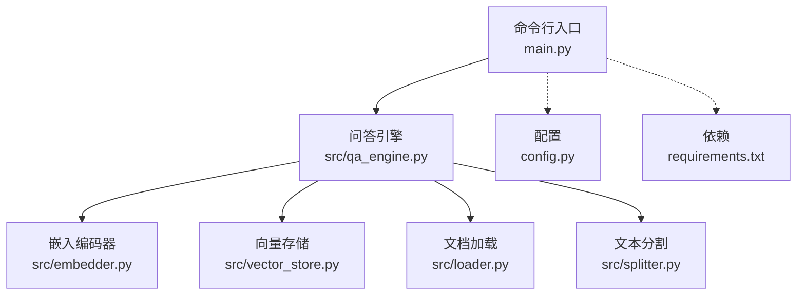
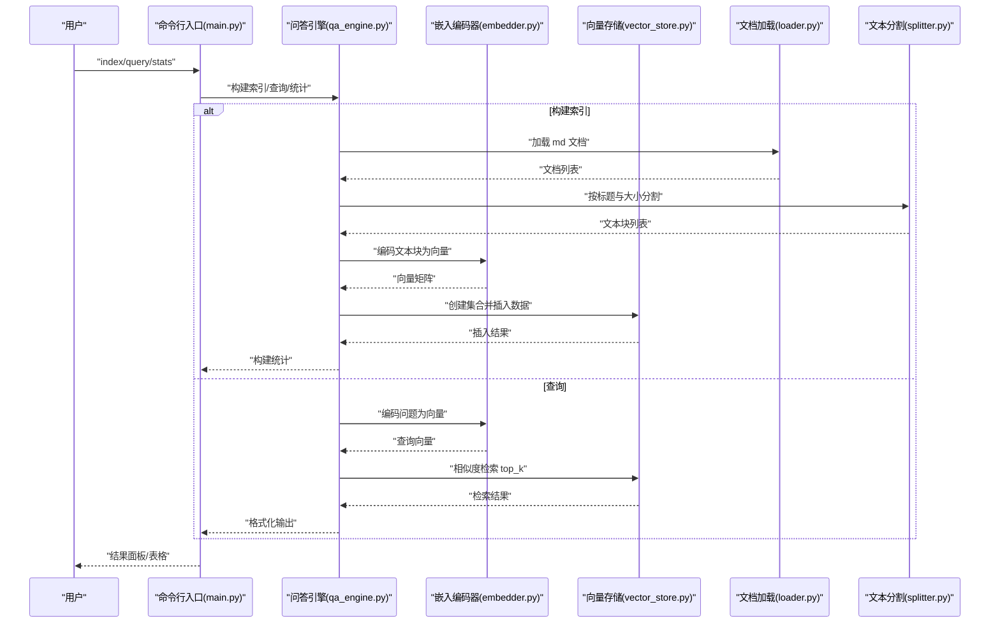
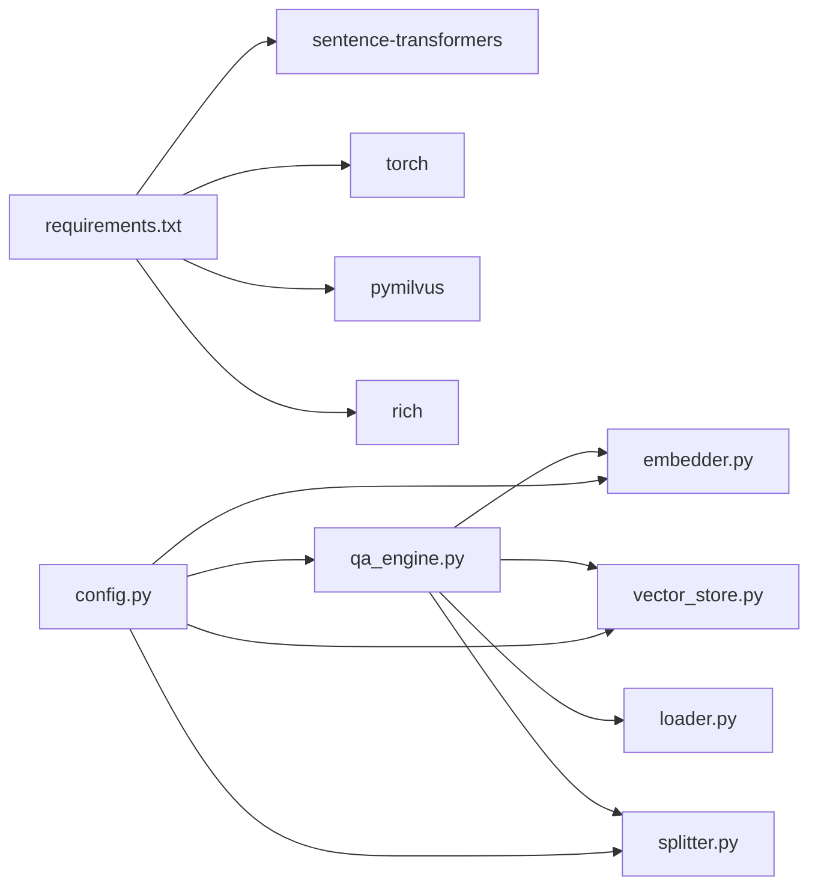

# 故障排除与常见问题

<cite>
**本文引用的文件**
- [main.py](file://main.py)
- [config.py](file://config.py)
- [requirements.txt](file://requirements.txt)
- [src/qa_engine.py](file://src/qa_engine.py)
- [src/embedder.py](file://src/embedder.py)
- [src/vector_store.py](file://src/vector_store.py)
- [src/loader.py](file://src/loader.py)
- [src/splitter.py](file://src/splitter.py)
- [docs/python-guide.md](file://docs/python-guide.md)
- [docs/docker-guide.md](file://docs/docker-guide.md)
- [docs/git-guide.md](file://docs/git-guide.md)
</cite>

## 目录
1. [简介](#简介)
2. [项目结构](#项目结构)
3. [核心组件](#核心组件)
4. [架构总览](#架构总览)
5. [详细组件分析](#详细组件分析)
6. [依赖关系分析](#依赖关系分析)
7. [性能考虑](#性能考虑)
8. [故障排除与常见问题](#故障排除与常见问题)
9. [结论](#结论)
10. [附录](#附录)

## 简介
本指南面向使用“MD 语义检索知识库”的用户，聚焦安装、配置与使用过程中的常见问题与解决方案。内容涵盖错误代码解读、调试技巧、性能问题诊断与优化、环境问题（内存、磁盘、网络）处理、日志分析与问题定位方法，以及不同操作系统与 Python 版本的兼容性建议。所有建议均基于代码实现与配置文件的实际行为，提供可操作的解决步骤与预防措施。

## 项目结构
项目采用模块化设计，命令行入口负责解析参数与调度业务流程；核心能力通过嵌入编码、文本分割、向量存储与检索引擎组合实现。配置集中于配置文件，依赖通过需求清单统一管理。

图表来源
- [main.py](file://main.py#L142-L194)
- [src/qa_engine.py](file://src/qa_engine.py#L13-L119)
- [src/embedder.py](file://src/embedder.py#L11-L86)
- [src/vector_store.py](file://src/vector_store.py#L10-L172)
- [src/loader.py](file://src/loader.py#L10-L57)
- [src/splitter.py](file://src/splitter.py#L10-L126)
- [config.py](file://config.py#L1-L24)
- [requirements.txt](file://requirements.txt#L1-L6)

章节来源
- [main.py](file://main.py#L142-L194)
- [config.py](file://config.py#L1-L24)
- [requirements.txt](file://requirements.txt#L1-L6)

## 核心组件
- 命令行入口与子命令：index、query、stats，负责参数解析、流程编排与用户交互。
- 问答引擎：封装构建索引与检索查询的完整流程。
- 嵌入编码器：基于本地模型加载与文本编码。
- 向量存储：基于 Milvus Lite 的集合创建、数据插入与相似度检索。
- 文档加载与统计：递归扫描 md 文件并统计文件与字符信息。
- 文本分割：按标题与大小进行智能分块，兼顾语义完整性与检索粒度。

章节来源
- [main.py](file://main.py#L24-L140)
- [src/qa_engine.py](file://src/qa_engine.py#L13-L119)
- [src/embedder.py](file://src/embedder.py#L11-L86)
- [src/vector_store.py](file://src/vector_store.py#L10-L172)
- [src/loader.py](file://src/loader.py#L10-L57)
- [src/splitter.py](file://src/splitter.py#L10-L126)

## 架构总览
下图展示从命令行到向量检索的关键调用链路与数据流。

图表来源
- [main.py](file://main.py#L24-L140)
- [src/qa_engine.py](file://src/qa_engine.py#L25-L101)
- [src/embedder.py](file://src/embedder.py#L36-L58)
- [src/vector_store.py](file://src/vector_store.py#L35-L128)
- [src/loader.py](file://src/loader.py#L10-L38)
- [src/splitter.py](file://src/splitter.py#L88-L125)

## 详细组件分析

### 命令行入口与交互
- index 子命令：校验目录存在性，提示构建进度，打印构建统计；失败时输出错误信息。
- query 子命令：检查索引状态，循环接收问题输入，执行检索并格式化输出；捕获键盘中断与异常。
- stats 子命令：调用引擎统计接口，以表格形式输出索引状态与文档块数量。

章节来源
- [main.py](file://main.py#L24-L140)

### 问答引擎
- 构建索引：加载文档 → 分割 → 编码 → 创建集合 → 插入数据 → 返回统计。
- 查询：编码问题 → 向量存储检索 → 结果格式化。
- 统计：委托向量存储获取集合状态与行数。

章节来源
- [src/qa_engine.py](file://src/qa_engine.py#L25-L101)

### 嵌入编码器
- 延迟加载模型，避免冷启动开销；支持单文本与批量编码；提供维度查询能力。

章节来源
- [src/embedder.py](file://src/embedder.py#L16-L68)

### 向量存储
- 连接 Milvus Lite；创建集合（支持重建）；插入向量与元数据；相似度检索；集合统计；关闭连接。

章节来源
- [src/vector_store.py](file://src/vector_store.py#L15-L154)

### 文档加载与统计
- 递归扫描 md 文件，读取 UTF-8 内容；对不可读文件发出警告；统计总数、字符数与平均长度。

章节来源
- [src/loader.py](file://src/loader.py#L10-L57)

### 文本分割
- 先按标题分段，再按大小与句号/换行等边界切分，保证语义完整性与块大小可控。

章节来源
- [src/splitter.py](file://src/splitter.py#L10-L125)

## 依赖关系分析
- 外部依赖：Milvus Lite、Sentence-Transformers、PyTorch、Rich。
- 内部模块耦合：问答引擎聚合嵌入编码器与向量存储；加载与分割作为数据前置处理；配置贯穿各模块。

图表来源
- [requirements.txt](file://requirements.txt#L1-L6)
- [src/qa_engine.py](file://src/qa_engine.py#L6-L10)
- [src/embedder.py](file://src/embedder.py#L7-L8)
- [src/vector_store.py](file://src/vector_store.py#L6-L7)
- [src/loader.py](file://src/loader.py#L5-L7)
- [src/splitter.py](file://src/splitter.py#L7)
- [config.py](file://config.py#L6-L23)

章节来源
- [requirements.txt](file://requirements.txt#L1-L6)
- [config.py](file://config.py#L6-L23)

## 性能考虑
- 向量维度与模型选择：高维模型（如 768 维）精度更高但内存与计算成本更高；可根据硬件条件调整模型与维度。
- 分块策略：增大分块大小可减少向量数量但降低局部召回；重叠有助于跨边界语义连贯。
- 检索 top_k：增大 top_k 提升召回但增加排序与输出成本；需结合业务权衡。
- 批量编码：嵌入编码器支持批量输入，建议在构建索引时以批处理提升吞吐。
- I/O 与磁盘：索引文件位于本地数据库路径，确保磁盘空间充足与写入权限；避免频繁重建集合。
- GPU/CPU：若硬件具备 CUDA 支持，确保 PyTorch 与模型正确利用加速设备。

[本节为通用性能建议，无需特定文件引用]

## 故障排除与常见问题

### 一、安装与环境问题
- Python 版本与依赖
  - 现象：安装依赖时报错或运行时报模块缺失。
  - 排查：确认 Python 版本满足依赖要求；优先使用虚拟环境隔离依赖。
  - 解决：根据需求清单安装依赖；若网络受限，使用国内镜像源。
  - 参考
    - [requirements.txt](file://requirements.txt#L1-L6)
    - [docs/python-guide.md](file://docs/python-guide.md#L12-L39)

- 系统兼容性
  - 现象：在某些系统上无法加载模型或 Milvus 客户端。
  - 排查：确认系统架构与依赖二进制兼容；检查动态库与运行时依赖。
  - 解决：升级系统或使用容器化运行；必要时更换更轻量的模型。
  - 参考
    - [docs/docker-guide.md](file://docs/docker-guide.md#L25-L49)

- 磁盘空间不足
  - 现象：构建索引时写入失败或报磁盘空间不足。
  - 排查：检查目标目录所在分区剩余空间；确认索引文件大小。
  - 解决：清理空间或更换更大容量磁盘；调整分块大小降低索引体积。
  - 参考
    - [config.py](file://config.py#L15)
    - [src/vector_store.py](file://src/vector_store.py#L35-L60)

- 内存不足
  - 现象：构建索引时内存占用过高导致 OOM。
  - 排查：监控进程内存峰值；评估文档总量与分块数量。
  - 解决：分批处理或降低分块大小；选择更低维度模型；启用更少并发。
  - 参考
    - [src/embedder.py](file://src/embedder.py#L36-L58)
    - [src/splitter.py](file://src/splitter.py#L47-L85)

- 网络连接问题
  - 现象：首次加载模型时下载失败或超时。
  - 排查：检查代理与防火墙；确认可访问模型仓库。
  - 解决：配置代理或离线缓存模型；使用国内镜像源；预先下载模型至本地。
  - 参考
    - [src/embedder.py](file://src/embedder.py#L26-L34)

### 二、配置问题
- 文档目录不存在
  - 现象：index 命令提示目录不存在。
  - 排查：确认传入路径是否正确；检查权限。
  - 解决：修正路径或创建目录；确保 UTF-8 编码的 md 文件。
  - 参考
    - [main.py](file://main.py#L30-L32)
    - [src/loader.py](file://src/loader.py#L23-L24)

- 索引为空或未建立
  - 现象：query 命令提示索引为空。
  - 排查：使用 stats 命令查看索引状态；确认是否已执行 index。
  - 解决：先执行 index 建立索引；检查文档是否被正确识别。
  - 参考
    - [main.py](file://main.py#L61-L65)
    - [src/qa_engine.py](file://src/qa_engine.py#L94-L101)

- 检索结果为空
  - 现象：query 返回空结果。
  - 排查：确认问题表述清晰；适当提高 top_k；检查索引是否包含有效文本块。
  - 解决：调整分块大小与重叠；优化问题表达；扩大检索范围。
  - 参考
    - [main.py](file://main.py#L88-L93)
    - [src/qa_engine.py](file://src/qa_engine.py#L75-L92)

### 三、运行时错误与调试
- 键盘中断
  - 现象：用户按 Ctrl+C 退出查询。
  - 处理：程序优雅退出；可在业务中添加保存上下文的逻辑。
  - 参考
    - [main.py](file://main.py#L118-L120)

- 未捕获异常
  - 现象：查询过程中抛出异常。
  - 排查：查看控制台输出的异常信息；定位具体环节（编码、检索、格式化）。
  - 解决：针对异常类型细化处理；补充日志记录。
  - 参考
    - [main.py](file://main.py#L121-L122)

- 模型加载失败
  - 现象：首次编码时报模型加载错误。
  - 排查：确认模型名称正确；网络可达；磁盘有足够空间缓存模型。
  - 解决：更换模型；离线部署模型；检查权限。
  - 参考
    - [src/embedder.py](file://src/embedder.py#L26-L34)

- Milvus 客户端异常
  - 现象：创建集合或插入数据失败。
  - 排查：检查数据库路径可写；确认集合名合法；查看客户端返回状态。
  - 解决：更换数据库路径；删除损坏文件后重建；降级到更稳定的版本。
  - 参考
    - [src/vector_store.py](file://src/vector_store.py#L35-L60)
    - [src/vector_store.py](file://src/vector_store.py#L62-L93)

### 四、日志分析与问题定位
- 控制台输出
  - index 流程会打印扫描、分割、编码、存储等阶段信息，便于定位卡顿或失败点。
  - 参考
    - [src/qa_engine.py](file://src/qa_engine.py#L36-L66)

- 统计信息
  - 使用 stats 命令快速判断索引是否存在、文档块数量是否合理。
  - 参考
    - [main.py](file://main.py#L125-L139)
    - [src/qa_engine.py](file://src/qa_engine.py#L94-L101)

- 文件读取异常
  - 若部分 md 文件读取失败，会输出警告；建议检查文件编码与权限。
  - 参考
    - [src/loader.py](file://src/loader.py#L35-L36)

### 五、性能问题诊断与优化
- 指标观察
  - 构建阶段：关注文档扫描耗时、分割数量、编码耗时、插入耗时。
  - 查询阶段：关注编码耗时、检索耗时、结果格式化耗时。
  - 参考
    - [src/qa_engine.py](file://src/qa_engine.py#L36-L92)

- 优化建议
  - 调整分块大小与重叠，平衡召回与性能。
  - 选择合适模型维度；必要时使用更小模型。
  - 批量编码与分批插入，避免一次性内存压力过大。
  - 使用容器化部署，隔离依赖并简化环境差异。
  - 参考
    - [config.py](file://config.py#L19-L23)
    - [docs/docker-guide.md](file://docs/docker-guide.md#L100-L123)

### 六、不同操作系统与 Python 版本兼容性
- Windows/macOS/Linux
  - 安装 Python 与包管理工具；使用虚拟环境；优先使用官方包。
  - 参考
    - [docs/python-guide.md](file://docs/python-guide.md#L14-L39)

- Docker 化运行
  - 使用官方基础镜像；最小化层数；排除无关文件；设置资源限制。
  - 参考
    - [docs/docker-guide.md](file://docs/docker-guide.md#L100-L123)
    - [docs/docker-guide.md](file://docs/docker-guide.md#L176-L183)

- Git 与版本管理
  - 建议使用 Git 管理项目；遵循工作流规范；注意分支与合并策略。
  - 参考
    - [docs/git-guide.md](file://docs/git-guide.md#L107-L124)

## 结论
本指南围绕安装、配置、使用与性能优化提供了系统性的故障排除方法。通过理解命令行流程、核心组件职责与配置项影响，用户可快速定位问题并采取针对性措施。建议在生产环境中采用容器化与版本控制，并持续监控关键指标以保障稳定性与可维护性。

## 附录
- 快速检查清单
  - 确认依赖已安装且版本满足要求
  - 确认文档目录存在且包含 md 文件
  - 确认索引已建立且非空
  - 确认磁盘空间与内存充足
  - 确认网络可访问模型仓库（如需在线下载）
  - 使用 stats 命令验证索引状态
  - 参考
    - [requirements.txt](file://requirements.txt#L1-L6)
    - [main.py](file://main.py#L125-L139)
    - [src/loader.py](file://src/loader.py#L23-L24)
    - [src/vector_store.py](file://src/vector_store.py#L130-L146)