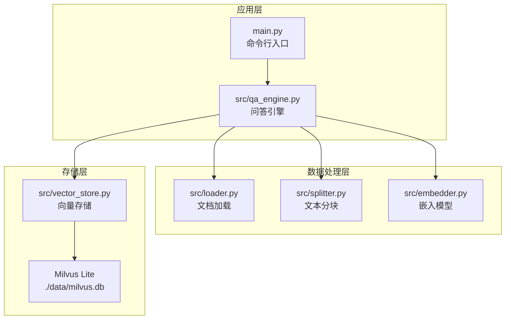
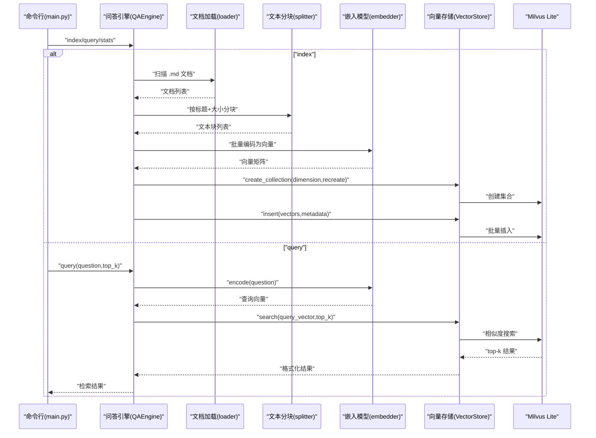
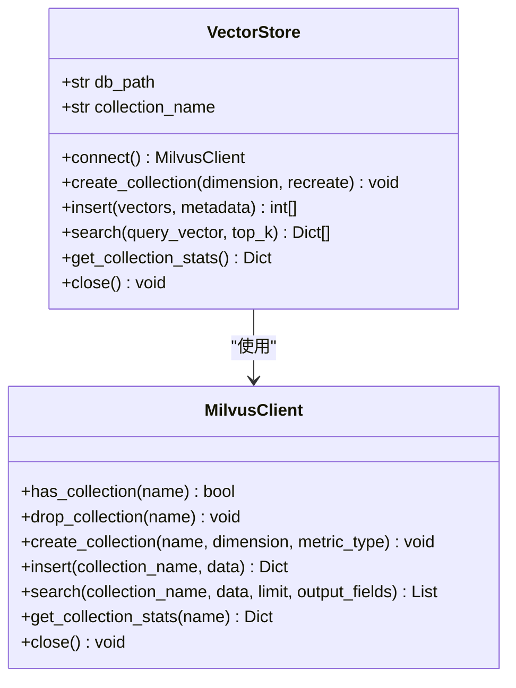
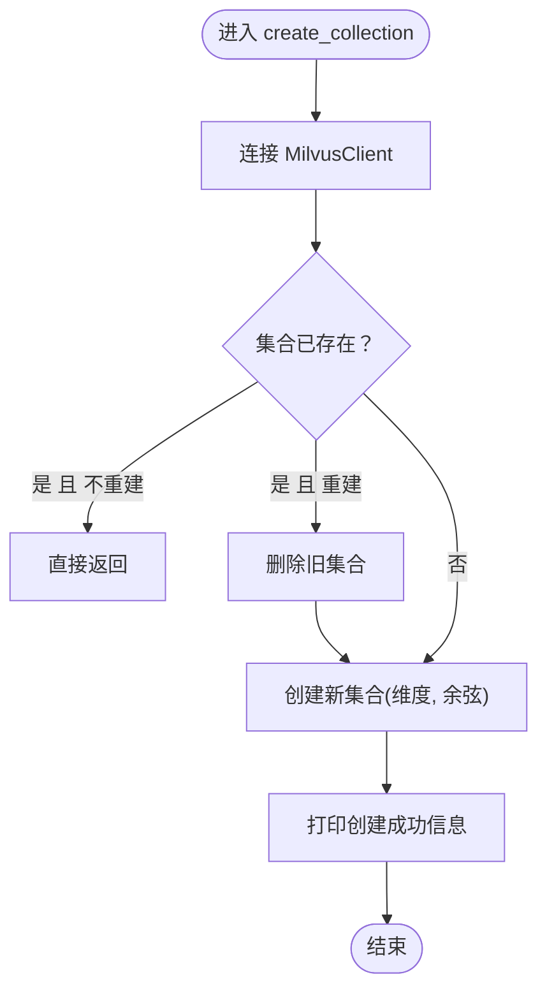
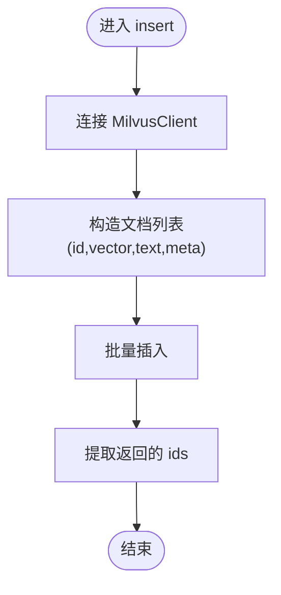
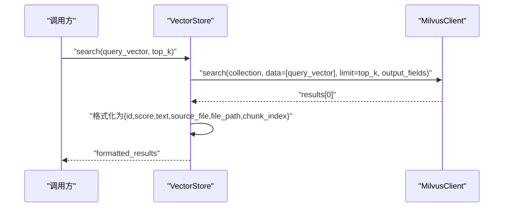
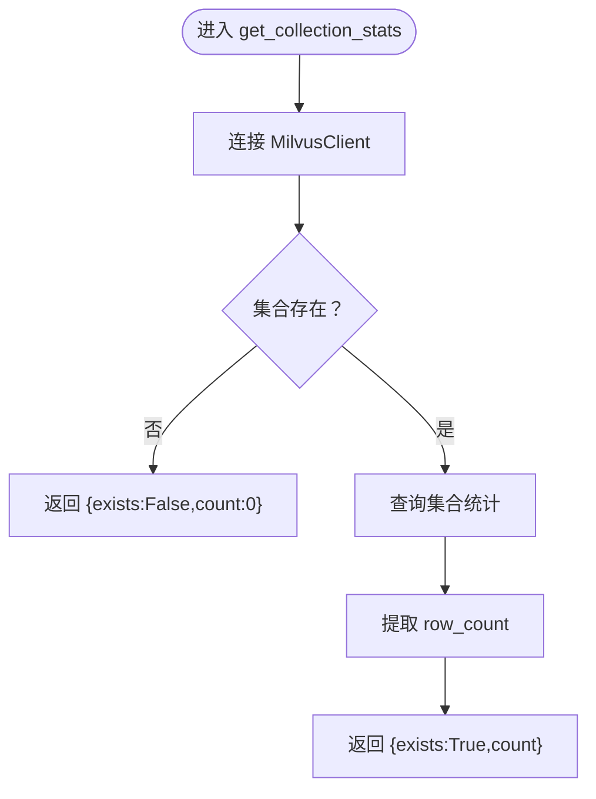
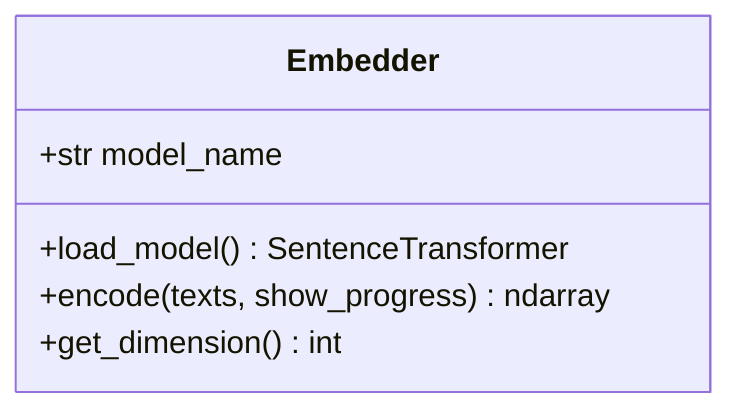
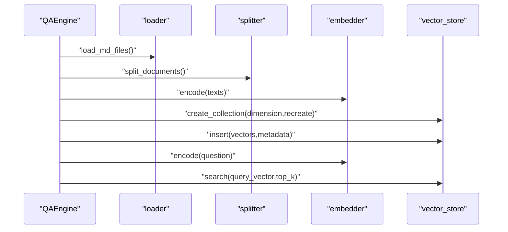
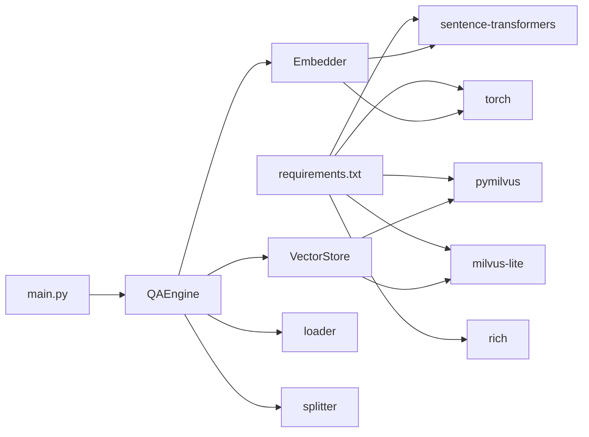

# 向量存储系统

<cite>
**本文引用的文件**
- [src/vector_store.py](file://src/vector_store.py)
- [src/embedder.py](file://src/embedder.py)
- [src/qa_engine.py](file://src/qa_engine.py)
- [src/loader.py](file://src/loader.py)
- [src/splitter.py](file://src/splitter.py)
- [config.py](file://config.py)
- [main.py](file://main.py)
- [requirements.txt](file://requirements.txt)
</cite>

## 目录
1. [简介](#简介)
2. [项目结构](#项目结构)
3. [核心组件](#核心组件)
4. [架构总览](#架构总览)
5. [详细组件分析](#详细组件分析)
6. [依赖关系分析](#依赖关系分析)
7. [性能考虑](#性能考虑)
8. [故障排查指南](#故障排查指南)
9. [结论](#结论)
10. [附录](#附录)

## 简介
本文件面向“向量存储系统”模块，围绕 VectorStore 类的设计与 Milvus Lite 集成展开，系统性说明以下能力：
- 集合创建流程（维度设置、重建选项）
- 数据插入机制（ID 生成、批量插入优化）
- 相似度搜索算法与 top-k 返回机制
- 统计信息获取
- 性能优化策略（索引配置、查询优化）
- 使用示例与错误处理
- 与嵌入模型的集成方式与数据格式转换

该系统以本地 Milvus Lite 作为向量数据库后端，结合本地嵌入模型生成向量，支持基于 Markdown 文档的知识库构建与检索问答。

## 项目结构
项目采用模块化设计，核心模块如下：
- 向量存储：VectorStore（封装 Milvus Lite 操作）
- 嵌入模型：Embedder（SentenceTransformer 封装）
- 知识库引擎：QAEngine（构建索引、问答查询）
- 文档加载与分块：loader、splitter
- 配置：config
- 入口：main.py

图表来源
- [main.py](file://main.py#L1-L194)
- [src/qa_engine.py](file://src/qa_engine.py#L1-L119)
- [src/loader.py](file://src/loader.py#L1-L57)
- [src/splitter.py](file://src/splitter.py#L1-L126)
- [src/embedder.py](file://src/embedder.py#L1-L86)
- [src/vector_store.py](file://src/vector_store.py#L1-L172)

章节来源
- [main.py](file://main.py#L1-L194)
- [src/qa_engine.py](file://src/qa_engine.py#L1-L119)
- [src/loader.py](file://src/loader.py#L1-L57)
- [src/splitter.py](file://src/splitter.py#L1-L126)
- [src/embedder.py](file://src/embedder.py#L1-L86)
- [src/vector_store.py](file://src/vector_store.py#L1-L172)

## 核心组件
- VectorStore：封装 Milvus Lite 的连接、集合管理、插入、搜索与统计查询，并提供全局单例访问。
- Embedder：封装本地嵌入模型加载与编码，支持批量编码与维度查询。
- QAEngine：串联文档加载、分块、嵌入、索引构建与查询。
- loader/splitter：负责 Markdown 文档扫描与智能分块。
- config：集中管理模型、Milvus、分块与检索参数。
- main.py：命令行入口，提供 index/query/stats 三类子命令。

章节来源
- [src/vector_store.py](file://src/vector_store.py#L10-L172)
- [src/embedder.py](file://src/embedder.py#L11-L86)
- [src/qa_engine.py](file://src/qa_engine.py#L13-L119)
- [src/loader.py](file://src/loader.py#L10-L57)
- [src/splitter.py](file://src/splitter.py#L10-L126)
- [config.py](file://config.py#L1-L24)
- [main.py](file://main.py#L1-L194)

## 架构总览
下图展示从命令行到 Milvus Lite 的完整调用链路与数据流。

图表来源
- [main.py](file://main.py#L24-L123)
- [src/qa_engine.py](file://src/qa_engine.py#L25-L92)
- [src/loader.py](file://src/loader.py#L10-L38)
- [src/splitter.py](file://src/splitter.py#L88-L125)
- [src/embedder.py](file://src/embedder.py#L36-L58)
- [src/vector_store.py](file://src/vector_store.py#L35-L128)

## 详细组件分析

### VectorStore 类设计与实现
VectorStore 是对 Milvus Lite 的轻量封装，职责清晰：
- 连接管理：延迟初始化 MilvusClient，避免无用开销。
- 集合管理：检查存在性、可选重建、创建集合并设置度量类型。
- 数据插入：构造包含 id、vector、text、source_file、file_path、chunk_index 的文档，批量插入并返回插入 ID。
- 相似度搜索：执行余弦相似度搜索，限制 top-k，输出标准化相似度分数与实体字段。
- 统计查询：返回集合是否存在与行数。
- 资源释放：显式关闭连接。

图表来源
- [src/vector_store.py](file://src/vector_store.py#L10-L172)

章节来源
- [src/vector_store.py](file://src/vector_store.py#L10-L172)

#### create_collection：集合创建流程
- 连接：首次调用时建立 MilvusClient。
- 存在性检查：若集合存在且不重建，则直接返回；否则根据 recreate 决定是否删除旧集合。
- 创建集合：指定集合名、维度与度量类型（余弦相似度）。
- 输出：打印创建成功信息，包含集合名与维度。

图表来源
- [src/vector_store.py](file://src/vector_store.py#L35-L60)

章节来源
- [src/vector_store.py](file://src/vector_store.py#L35-L60)

#### insert：数据插入机制
- 连接：确保已连接 MilvusClient。
- 数据构造：遍历向量与元数据，构造包含 id、vector、text、source_file、file_path、chunk_index 的文档列表。
- 批量插入：调用 MilvusClient.insert，返回包含 ids 的结果。
- 返回：提取并返回插入 ID 列表。

图表来源
- [src/vector_store.py](file://src/vector_store.py#L62-L93)

章节来源
- [src/vector_store.py](file://src/vector_store.py#L62-L93)

#### search：相似度搜索与 top-k 返回
- 连接：确保已连接 MilvusClient。
- 查询：以查询向量为输入，限制返回 top_k，指定输出字段。
- 结果格式化：将 Milvus 返回的 id/distance/entity 转换为统一结构，其中相似度分数由 1 - distance 计算得到。
- 返回：返回包含 id、score、text、source_file、file_path、chunk_index 的结果列表。

图表来源
- [src/vector_store.py](file://src/vector_store.py#L95-L128)

章节来源
- [src/vector_store.py](file://src/vector_store.py#L95-L128)

#### get_collection_stats：统计信息获取
- 连接：确保已连接 MilvusClient。
- 存在性判断：若集合不存在，返回不存在与计数为 0。
- 统计查询：调用 MilvusClient.get_collection_stats，提取 row_count 并返回存在性与计数。

图表来源
- [src/vector_store.py](file://src/vector_store.py#L130-L146)

章节来源
- [src/vector_store.py](file://src/vector_store.py#L130-L146)

### 嵌入模型集成（Embedder）
- 延迟加载：首次使用时才加载模型，减少启动时间。
- 编码接口：支持单文本与文本列表，返回 NumPy 数组；可选择显示进度条。
- 维度查询：通过模型接口获取向量维度，用于后续集合创建。

图表来源
- [src/embedder.py](file://src/embedder.py#L11-L86)

章节来源
- [src/embedder.py](file://src/embedder.py#L11-L86)

### 知识库引擎（QAEngine）
- 构建索引：加载文档、分块、编码、创建集合、批量插入。
- 查询问答：将问题编码为向量，在向量库中搜索并返回 top-k 结果。
- 统计查询：委托给 VectorStore 获取集合统计。

图表来源
- [src/qa_engine.py](file://src/qa_engine.py#L25-L92)

章节来源
- [src/qa_engine.py](file://src/qa_engine.py#L13-L119)

### 文档加载与分块（loader/splitter）
- loader：递归扫描目录，读取 .md 文件内容，返回文档列表。
- splitter：先按标题分段，再按大小与重叠切分，生成包含 chunk_text、source_file、file_path、chunk_index 的块列表。

章节来源
- [src/loader.py](file://src/loader.py#L10-L57)
- [src/splitter.py](file://src/splitter.py#L10-L126)

### 配置（config）
- 模型与维度：EMBEDDING_MODEL、VECTOR_DIM。
- Milvus：MILVUS_DB_PATH、COLLECTION_NAME。
- 分块：CHUNK_SIZE、CHUNK_OVERLAP。
- 检索：TOP_K。

章节来源
- [config.py](file://config.py#L1-L24)

## 依赖关系分析
- 外部依赖：pymilvus、milvus-lite、sentence-transformers、torch、rich。
- 内部耦合：QAEngine 依赖 Embedder、VectorStore、loader、splitter；VectorStore 依赖 Milvus Lite；Embedder 依赖 SentenceTransformer。
- 单例模式：VectorStore 与 Embedder、QAEngine 均提供全局单例访问，避免重复初始化。

图表来源
- [requirements.txt](file://requirements.txt#L1-L6)
- [src/qa_engine.py](file://src/qa_engine.py#L1-L119)
- [src/vector_store.py](file://src/vector_store.py#L1-L172)
- [src/embedder.py](file://src/embedder.py#L1-L86)
- [src/loader.py](file://src/loader.py#L1-L57)
- [src/splitter.py](file://src/splitter.py#L1-L126)
- [main.py](file://main.py#L1-L194)

章节来源
- [requirements.txt](file://requirements.txt#L1-L6)
- [src/qa_engine.py](file://src/qa_engine.py#L1-L119)
- [src/vector_store.py](file://src/vector_store.py#L1-L172)
- [src/embedder.py](file://src/embedder.py#L1-L86)
- [src/loader.py](file://src/loader.py#L1-L57)
- [src/splitter.py](file://src/splitter.py#L1-L126)
- [main.py](file://main.py#L1-L194)

## 性能考虑
- 索引与度量类型
  - 当前使用余弦相似度（COSINE），适合高维稀疏向量与归一化场景。如需进一步加速，可评估 L2 距离与相应索引类型（取决于 Milvus Lite 支持情况）。
- 批量操作
  - 插入采用批量写入，建议控制单批大小以平衡内存占用与吞吐；必要时分批提交。
- 维度与存储
  - 高维向量会显著增加存储与计算成本。结合实际硬件资源调整 VECTOR_DIM 与 CHUNK_SIZE。
- 查询优化
  - 限制 top_k，避免返回过多结果；仅请求必要字段（output_fields）以减少网络与序列化开销。
- 模型与编码
  - 延迟加载嵌入模型，避免冷启动；批量编码文本，减少模型调用次数。
- I/O 与磁盘
  - Milvus Lite 本地数据库位于 ./data/milvus.db，建议确保磁盘空间充足与良好的 I/O 性能。

[本节为通用性能建议，无需特定文件引用]

## 故障排查指南
- 集合不存在或为空
  - 在查询前检查统计信息，若集合不存在或计数为 0，提示先执行索引构建。
- 文档目录不存在
  - loader 抛出 FileNotFoundError，确认 docs_dir 路径正确。
- 向量维度不匹配
  - create_collection 的 dimension 必须与嵌入模型输出一致；QAEngine 会自动从编码结果推导维度。
- Milvus 连接异常
  - 确认 Milvus Lite 已安装且 db_path 可写；VectorStore 提供连接与关闭方法，注意在长时间任务中及时释放。
- 查询无结果
  - 检查 top_k 设置与相似度阈值；适当提高 top_k 或调整问题表述以提升召回。

章节来源
- [main.py](file://main.py#L60-L65)
- [src/loader.py](file://src/loader.py#L23-L24)
- [src/qa_engine.py](file://src/qa_engine.py#L56-L66)
- [src/vector_store.py](file://src/vector_store.py#L130-L146)

## 结论
本向量存储系统以 Milvus Lite 为核心，结合本地嵌入模型与智能分块策略，实现了从文档到向量索引再到语义检索的完整链路。VectorStore 提供简洁稳定的 API，覆盖集合管理、批量插入、相似度搜索与统计查询；QAEngine 将各模块有机整合，形成可扩展的知识库构建与问答框架。通过合理的配置与性能优化策略，可在本地环境下高效运行。

[本节为总结性内容，无需特定文件引用]

## 附录

### 使用示例
- 建立索引
  - 运行命令：python main.py index --docs-dir ./docs
  - 流程：扫描 .md → 分块 → 编码 → 创建集合 → 批量插入
- 问答查询
  - 运行命令：python main.py query --top-k 5
  - 流程：问题编码 → 向量库搜索 → 格式化返回
- 查看统计
  - 运行命令：python main.py stats

章节来源
- [main.py](file://main.py#L24-L140)
- [src/qa_engine.py](file://src/qa_engine.py#L25-L92)

### 错误处理方案
- 空索引保护：查询前检查集合存在性与计数，提示用户先构建索引。
- 文件读取异常：loader 对单个文件读取失败进行告警并继续处理其他文件。
- 连接与关闭：VectorStore 提供 close 方法，建议在应用退出或长时间空闲时调用。

章节来源
- [main.py](file://main.py#L60-L65)
- [src/loader.py](file://src/loader.py#L35-L36)
- [src/vector_store.py](file://src/vector_store.py#L148-L154)

### 与嵌入模型的集成与数据格式
- 嵌入模型
  - 使用 SentenceTransformer，延迟加载；encode 支持字符串与列表，返回 NumPy 数组。
  - get_dimension 获取向量维度，用于集合创建。
- 数据格式
  - 插入文档包含：id、vector、text、source_file、file_path、chunk_index。
  - 搜索输出包含：id、score（由距离转换而来）、text、source_file、file_path、chunk_index。

章节来源
- [src/embedder.py](file://src/embedder.py#L36-L68)
- [src/vector_store.py](file://src/vector_store.py#L75-L93)
- [src/vector_store.py](file://src/vector_store.py#L116-L127)