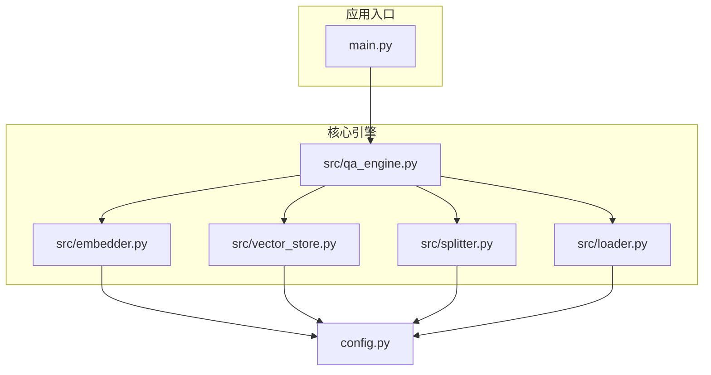
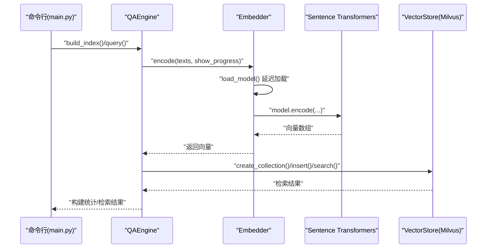
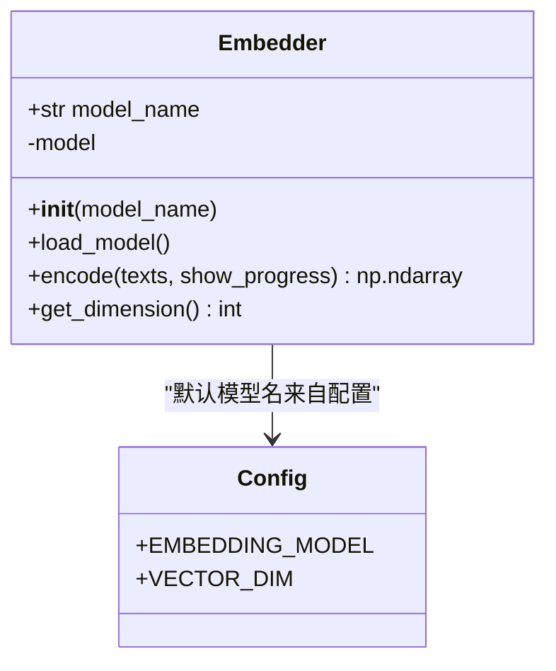
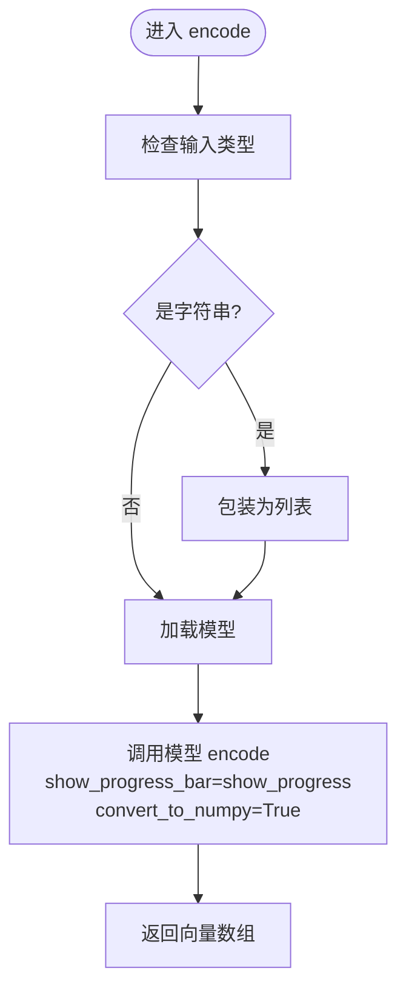
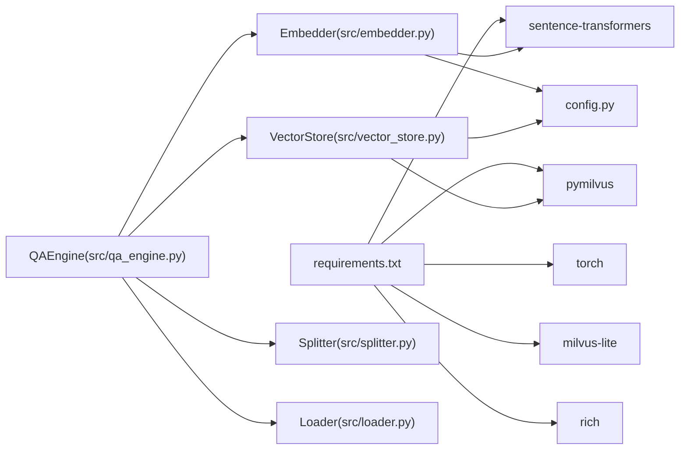

# 嵌入模型封装

<cite>
**本文引用的文件**
- [src/embedder.py](file://src/embedder.py)
- [config.py](file://config.py)
- [src/qa_engine.py](file://src/qa_engine.py)
- [src/vector_store.py](file://src/vector_store.py)
- [src/splitter.py](file://src/splitter.py)
- [src/loader.py](file://src/loader.py)
- [main.py](file://main.py)
- [requirements.txt](file://requirements.txt)
</cite>

## 目录
1. [简介](#简介)
2. [项目结构](#项目结构)
3. [核心组件](#核心组件)
4. [架构总览](#架构总览)
5. [详细组件分析](#详细组件分析)
6. [依赖关系分析](#依赖关系分析)
7. [性能考量](#性能考量)
8. [故障排查指南](#故障排查指南)
9. [结论](#结论)
10. [附录](#附录)

## 简介
本文件面向“嵌入模型封装”模块，系统性阐述 Embedder 类的设计与实现，重点覆盖以下方面：
- Sentence Transformers 库的集成方式与模型加载策略
- 延迟加载机制的工作原理与性能优势
- encode 方法的文本编码流程，包括批量编码与进度显示
- 向量维度检测与验证机制
- 模型配置选项与参数调优建议
- 使用示例与不同文本输入类型的处理
- 内存管理与性能优化策略，以及与 QA 引擎、向量存储等模块的集成方式

## 项目结构
该项目围绕“文档加载—文本分割—向量编码—向量存储—检索问答”的完整链路构建，嵌入模型封装位于核心层，向上被 QA 引擎调用，向下依赖配置与外部库。

图表来源
- [main.py](file://main.py#L1-L194)
- [src/qa_engine.py](file://src/qa_engine.py#L1-L119)
- [src/embedder.py](file://src/embedder.py#L1-L86)
- [src/vector_store.py](file://src/vector_store.py#L1-L172)
- [src/splitter.py](file://src/splitter.py#L1-L126)
- [src/loader.py](file://src/loader.py#L1-L57)
- [config.py](file://config.py#L1-L24)

章节来源
- [main.py](file://main.py#L1-L194)
- [src/qa_engine.py](file://src/qa_engine.py#L1-L119)
- [src/embedder.py](file://src/embedder.py#L1-L86)
- [src/vector_store.py](file://src/vector_store.py#L1-L172)
- [src/splitter.py](file://src/splitter.py#L1-L126)
- [src/loader.py](file://src/loader.py#L1-L57)
- [config.py](file://config.py#L1-L24)

## 核心组件
- Embedder：封装 Sentence Transformers 模型，提供延迟加载、批量编码、维度查询与全局单例访问。
- QAEngine：编排“加载—分割—编码—入库—检索”的完整流程，调用 Embedder 与 VectorStore。
- VectorStore：基于 Milvus Lite 的向量存储封装，负责集合创建、数据插入与相似度检索。
- Splitter：针对 Markdown 的智能分块，支持按标题与长度切分，并保留上下文连续性。
- Loader：递归扫描 md 文档，读取内容并统计基础信息。
- 配置：集中管理嵌入模型、向量维度、Milvus 参数、分块策略与检索参数。

章节来源
- [src/embedder.py](file://src/embedder.py#L11-L86)
- [src/qa_engine.py](file://src/qa_engine.py#L13-L119)
- [src/vector_store.py](file://src/vector_store.py#L10-L172)
- [src/splitter.py](file://src/splitter.py#L10-L126)
- [src/loader.py](file://src/loader.py#L10-L57)
- [config.py](file://config.py#L5-L24)

## 架构总览
下图展示了从命令行入口到向量检索的整体调用链，以及嵌入模型封装在其中的关键位置。

图表来源
- [main.py](file://main.py#L24-L123)
- [src/qa_engine.py](file://src/qa_engine.py#L25-L92)
- [src/embedder.py](file://src/embedder.py#L26-L58)
- [src/vector_store.py](file://src/vector_store.py#L35-L128)

## 详细组件分析

### Embedder 类设计与实现
- 设计目标
  - 对外暴露统一接口，屏蔽底层模型加载细节
  - 支持延迟加载以减少启动时资源占用
  - 提供批量编码与进度显示能力
  - 提供向量维度查询，便于下游模块校验一致性

- 关键方法与职责
  - 初始化与延迟加载
    - 通过构造函数接收模型名，默认来自配置
    - load_model 在首次使用时才实例化模型，避免常驻内存
  - 编码接口 encode
    - 接受单个字符串或字符串列表，内部统一封装为列表
    - 调用底层模型进行编码，支持进度条显示与 NumPy 输出
  - 维度查询 get_dimension
    - 通过底层模型提供的维度接口获取向量维度
  - 全局单例 get_embedder
    - 提供全局唯一实例，避免重复初始化

- 类关系图

图表来源
- [src/embedder.py](file://src/embedder.py#L11-L86)
- [config.py](file://config.py#L5-L12)

章节来源
- [src/embedder.py](file://src/embedder.py#L11-L86)
- [config.py](file://config.py#L5-L12)

### 延迟加载机制
- 工作原理
  - Embedder 在构造时仅保存模型名，不立即加载模型
  - 首次调用 load_model 或 encode/get_dimension 时触发实际加载
  - 加载完成后缓存模型实例，后续调用直接复用
- 性能优势
  - 减少冷启动时间与内存占用
  - 仅在需要时消耗 GPU/CPU 资源
  - 适合 CLI 场景与多模块组合使用

章节来源
- [src/embedder.py](file://src/embedder.py#L26-L34)

### encode 方法的文本编码流程
- 输入处理
  - 若输入为单个字符串，自动包装为列表，保证批处理一致性
- 批量编码
  - 调用底层模型的 encode 接口，传入 show_progress_bar 控制是否显示进度条
  - convert_to_numpy 确保输出为 NumPy 数组，便于后续向量化操作
- 输出格式
  - 返回二维 NumPy 数组，形状为 [N, D]，其中 N 为文本数量，D 为向量维度

- 流程图

图表来源
- [src/embedder.py](file://src/embedder.py#L36-L58)

章节来源
- [src/embedder.py](file://src/embedder.py#L36-L58)

### 向量维度检测与验证机制
- 维度检测
  - 通过 get_dimension 调用底层模型接口获取维度
- 验证与一致性
  - QA 引擎在构建索引时，会根据编码结果的列数设置向量维度
  - VectorStore 在创建集合时使用该维度，确保后续插入与检索一致
- 建议
  - 不同模型的维度不同，应保持配置与实际编码维度一致
  - 如需切换模型，需重建集合以匹配新的维度

章节来源
- [src/embedder.py](file://src/embedder.py#L60-L68)
- [src/qa_engine.py](file://src/qa_engine.py#L58-L66)
- [src/vector_store.py](file://src/vector_store.py#L35-L60)

### 模型配置选项与参数调优指南
- 模型选择
  - 配置文件提供多种预设模型，涵盖中英双语、中文为主、多语言与英文场景
  - 默认采用中英双语效果较好的模型，向量维度为 768
- 参数调优建议
  - 模型维度与向量数据库集合维度必须一致
  - 批量编码时可开启进度条以便观察耗时
  - 大规模文档编码时，建议分批处理并监控内存占用
- 配置项参考
  - EMBEDDING_MODEL：嵌入模型名称或路径
  - VECTOR_DIM：向量维度（与模型匹配）

章节来源
- [config.py](file://config.py#L5-L12)
- [src/embedder.py](file://src/embedder.py#L16-L24)

### 使用示例与不同文本输入类型
- 单个文本编码
  - 输入为字符串，返回一维向量
- 批量文本编码
  - 输入为字符串列表，返回二维向量数组
- 进度显示
  - 通过参数控制是否显示进度条，适用于大规模编码任务
- 示例调用路径
  - 构建索引时的批量编码与进度显示
  - 问答查询时的单条问题编码

章节来源
- [src/qa_engine.py](file://src/qa_engine.py#L53-L54)
- [src/qa_engine.py](file://src/qa_engine.py#L87-L87)
- [src/embedder.py](file://src/embedder.py#L36-L58)

### 内存管理与性能优化策略
- 延迟加载
  - 仅在首次使用时加载模型，降低常驻内存占用
- 批量处理
  - 通过列表输入实现批量编码，提升吞吐量
- 进度条
  - 开启进度条有助于监控耗时与资源使用情况
- 集合维度一致性
  - 严格保持配置、编码与存储的维度一致，避免运行时错误
- 依赖版本
  - 依赖包版本需满足最低要求，确保稳定运行

章节来源
- [src/embedder.py](file://src/embedder.py#L26-L34)
- [src/embedder.py](file://src/embedder.py#L36-L58)
- [src/vector_store.py](file://src/vector_store.py#L35-L60)
- [requirements.txt](file://requirements.txt#L1-L6)

### 与其他模块的集成方式
- 与 QA 引擎
  - QAEngine 在构建索引与查询时均通过 Embedder 进行文本编码
- 与向量存储
  - 编码得到的向量维度用于创建 Milvus 集合，并作为插入与检索的基础
- 与文本分割与加载
  - 在编码前由 Splitter 与 Loader 完成文档加载与分块，保证输入粒度合理

章节来源
- [src/qa_engine.py](file://src/qa_engine.py#L25-L92)
- [src/vector_store.py](file://src/vector_store.py#L35-L128)
- [src/splitter.py](file://src/splitter.py#L88-L125)
- [src/loader.py](file://src/loader.py#L10-L38)

## 依赖关系分析
- 外部依赖
  - sentence-transformers：提供本地嵌入模型推理能力
  - torch：深度学习后端
  - pymilvus、milvus-lite：向量数据库客户端与本地运行支持
  - rich：命令行界面与进度显示
- 内部依赖
  - Embedder 依赖配置中的模型名与维度
  - QAEngine 依赖 Embedder、VectorStore、Splitter、Loader
  - VectorStore 依赖配置中的数据库路径、集合名与维度

图表来源
- [requirements.txt](file://requirements.txt#L1-L6)
- [src/embedder.py](file://src/embedder.py#L7-L8)
- [src/qa_engine.py](file://src/qa_engine.py#L6-L10)
- [src/vector_store.py](file://src/vector_store.py#L6-L7)
- [config.py](file://config.py#L5-L12)

章节来源
- [requirements.txt](file://requirements.txt#L1-L6)
- [src/embedder.py](file://src/embedder.py#L7-L8)
- [src/qa_engine.py](file://src/qa_engine.py#L6-L10)
- [src/vector_store.py](file://src/vector_store.py#L6-L7)
- [config.py](file://config.py#L5-L12)

## 性能考量
- 延迟加载与按需初始化
  - 避免不必要的模型加载，降低启动开销
- 批量编码
  - 一次处理多个文本，提高吞吐量，减少调用开销
- 进度条与可观测性
  - 在大规模任务中启用进度条，便于监控与资源规划
- 维度一致性
  - 严格匹配配置与编码维度，避免运行时异常与二次回退
- 依赖版本与硬件
  - 确保依赖版本满足要求；在 GPU 可用时可显著加速推理

## 故障排查指南
- 模型加载失败
  - 检查模型名称或路径是否正确，确认网络可达或本地缓存可用
- 维度不匹配
  - 确认配置中的 VECTOR_DIM 与实际编码维度一致；必要时重建集合
- 向量数据库连接问题
  - 检查数据库路径与集合名；确认 milvus-lite 正常运行
- 文档加载异常
  - 检查文档目录是否存在；确认文件编码为 UTF-8
- 进度条无显示
  - 确认 rich 包安装正常；在某些终端环境下可能不支持进度条渲染

章节来源
- [config.py](file://config.py#L14-L23)
- [src/vector_store.py](file://src/vector_store.py#L27-L33)
- [src/loader.py](file://src/loader.py#L23-L24)
- [requirements.txt](file://requirements.txt#L1-L6)

## 结论
Embedder 模块通过延迟加载、批量编码与维度检测等机制，为上层 QA 引擎提供了高效稳定的嵌入能力。结合 Splitter、Loader、VectorStore 与配置管理，形成了完整的本地语义检索知识库流水线。建议在生产环境中：
- 明确模型与维度配置，确保一致性
- 在大规模任务中启用批量编码与进度条
- 注意内存与硬件资源的合理分配
- 按需重建集合以适配模型切换

## 附录
- 常用命令
  - 建立索引：python main.py index --docs-dir ./docs
  - 问答模式：python main.py query
  - 查看统计：python main.py stats
- 全局单例
  - 通过 get_embedder() 获取 Embedder 实例，避免重复初始化
  - 通过 get_qa_engine() 获取 QAEngine 实例
  - 通过 get_vector_store() 获取 VectorStore 实例

章节来源
- [main.py](file://main.py#L146-L189)
- [src/qa_engine.py](file://src/qa_engine.py#L108-L118)
- [src/embedder.py](file://src/embedder.py#L75-L85)
- [src/vector_store.py](file://src/vector_store.py#L161-L171)