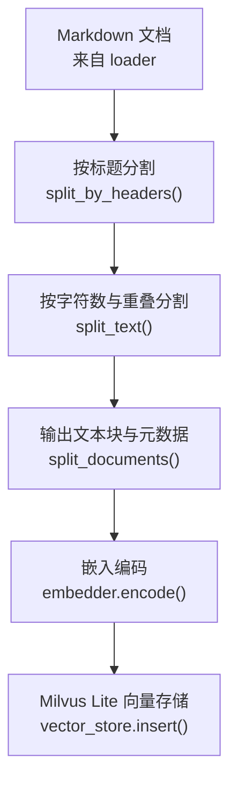
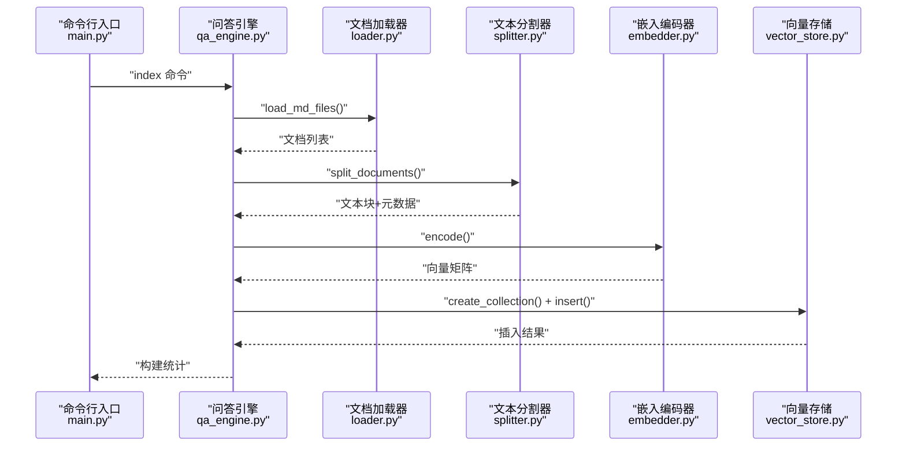
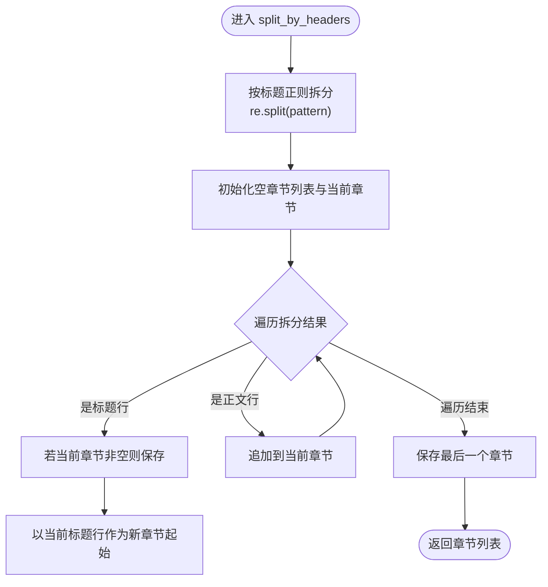
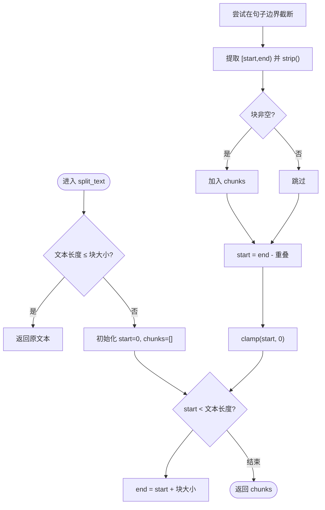
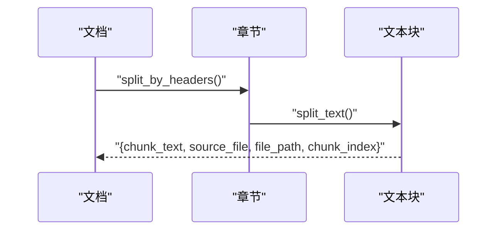
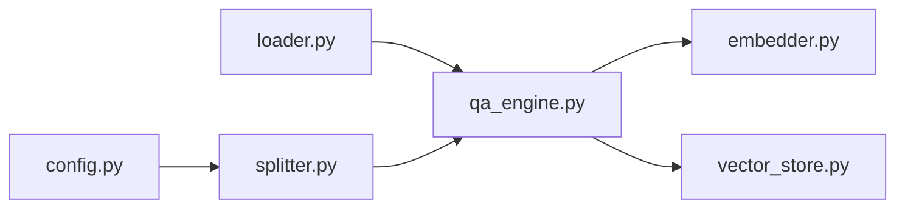

# 文本分割器

<cite>
**本文引用的文件**
- [src/splitter.py](file://src/splitter.py)
- [src/loader.py](file://src/loader.py)
- [src/qa_engine.py](file://src/qa_engine.py)
- [config.py](file://config.py)
- [main.py](file://main.py)
- [docs/python-guide.md](file://docs/python-guide.md)
- [docs/git-guide.md](file://docs/git-guide.md)
</cite>

## 目录
1. [简介](#简介)
2. [项目结构](#项目结构)
3. [核心组件](#核心组件)
4. [架构总览](#架构总览)
5. [详细组件分析](#详细组件分析)
6. [依赖关系分析](#依赖关系分析)
7. [性能考量](#性能考量)
8. [故障排查指南](#故障排查指南)
9. [结论](#结论)
10. [附录](#附录)

## 简介
本文件聚焦“文本分割器”模块，系统性阐述其针对 Markdown 文档的智能分块设计与实现，覆盖以下关键主题：
- 按标题层级（H1–H6）的分割机制与实现细节
- 字符数分割策略与重叠窗口技术
- 分割参数配置项（最大长度、重叠比例等）
- 分割后文本块的结构与元数据保留
- 分割效果的可视化示例与质量评估方法
- 不同文档类型的分割示例
- 分割策略对后续向量检索精度的影响与优化建议

## 项目结构
该模块位于 src/splitter.py，负责将 Markdown 文档先按标题层级切分为“章节”，再对每个章节按字符数与重叠策略切分为“文本块”。整体数据流如下图所示。

图表来源
- [src/splitter.py](file://src/splitter.py#L10-L44)
- [src/splitter.py](file://src/splitter.py#L47-L85)
- [src/splitter.py](file://src/splitter.py#L88-L125)
- [src/loader.py](file://src/loader.py#L10-L38)
- [src/qa_engine.py](file://src/qa_engine.py#L25-L73)
- [src/qa_engine.py](file://src/qa_engine.py#L75-L92)

章节来源
- [src/splitter.py](file://src/splitter.py#L1-L126)
- [src/loader.py](file://src/loader.py#L1-L57)
- [src/qa_engine.py](file://src/qa_engine.py#L1-L119)

## 核心组件
- 按标题分割：将 Markdown 文本按标题层级（# 至 ######）拆分为若干“章节”，确保标题与其正文在同一节内，避免跨标题的片段化。
- 字符数与重叠分割：在每个章节内部，按设定的最大长度与重叠长度进行切分，尽量在句子边界处切分以保持语义完整性。
- 文档级分块：遍历所有文档，先按标题分割，再按字符数分割，并为每个块附加来源文件名、完整路径与块序号等元数据。

章节来源
- [src/splitter.py](file://src/splitter.py#L10-L44)
- [src/splitter.py](file://src/splitter.py#L47-L85)
- [src/splitter.py](file://src/splitter.py#L88-L125)

## 架构总览
下图展示了从文档加载到向量入库的整体流程，以及文本分割器在其中的位置与职责。

图表来源
- [main.py](file://main.py#L24-L52)
- [src/qa_engine.py](file://src/qa_engine.py#L25-L73)
- [src/loader.py](file://src/loader.py#L10-L38)
- [src/splitter.py](file://src/splitter.py#L88-L125)
- [src/embedder.py](file://src/embedder.py#L36-L58)
- [src/vector_store.py](file://src/vector_store.py#L35-L93)

## 详细组件分析

### 按标题层级分割（H1–H6）
- 设计目标：保证每个标题与其正文在同一个“章节”内，避免标题与正文被切分到不同块，从而提升检索时的上下文完整性。
- 实现要点：
  - 使用正则表达式匹配以“#”开头的标题行（支持 H1–H6），并以该行为分隔符拆分文档。
  - 遍历拆分结果，遇到标题行时，若已有累积内容则先保存为一个章节；随后将当前标题行作为新章节的起始。
  - 最终保存最后一个章节。
- 复杂度：时间复杂度近似 O(n)，空间复杂度 O(n)，n 为文档字符数。

图表来源
- [src/splitter.py](file://src/splitter.py#L10-L44)

章节来源
- [src/splitter.py](file://src/splitter.py#L10-L44)

### 字符数分割与重叠窗口
- 设计目标：在保持语义连贯的前提下，将长文本切分为固定大小的块，并通过重叠窗口保留跨块边界的信息。
- 实现要点：
  - 若文本长度不超过块大小，则直接返回整段。
  - 从起点开始逐步推进，每步到达“块大小”的位置。
  - 在到达块末尾前尝试在常见句子边界（如段落分隔、中文/英文标点）处截断，以减少语义断裂。
  - 计算下一个块的起点为“当前块末尾 - 重叠长度”，避免负偏移。
  - 忽略空白块，仅保留非空块。
- 复杂度：最坏情况下对每个块进行一次反向查找句子边界，整体复杂度约为 O(n·k)，k 为句子分隔符数量（常数级）。

图表来源
- [src/splitter.py](file://src/splitter.py#L47-L85)

章节来源
- [src/splitter.py](file://src/splitter.py#L47-L85)

### 文档级分块与元数据保留
- 设计目标：将每个文档的多个章节进一步切分为文本块，并为每个块附加来源信息，便于检索后溯源与回放。
- 实现要点：
  - 遍历每个文档，先按标题分割得到章节列表。
  - 对每个章节调用字符数分割，得到文本块列表。
  - 为每个文本块构造字典，包含：块文本、源文件名、完整路径、块序号。
  - 序号按章节顺序累增，确保同一文档内的块有序。
- 输出结构：每个元素为包含键“chunk_text”、“source_file”、“file_path”、“chunk_index”的字典。

图表来源
- [src/splitter.py](file://src/splitter.py#L88-L125)

章节来源
- [src/splitter.py](file://src/splitter.py#L88-L125)

### 分割参数配置
- 配置项来源：config.py
  - CHUNK_SIZE：默认 500，表示每个文本块的最大字符数。
  - CHUNK_OVERLAP：默认 50，表示相邻文本块之间的重叠字符数。
- 影响范围：上述两个参数直接影响 split_text 的块大小与重叠策略，进而影响检索召回与上下文连续性。

章节来源
- [config.py](file://config.py#L18-L21)
- [src/splitter.py](file://src/splitter.py#L47-L85)

### 分割效果可视化与质量评估
- 可视化建议：
  - 在命令行中打印每个文档的原始字符数、分割后块数、平均块大小等统计信息。
  - 在问答模式中展示检索结果时，截断过长文本并高亮相似度分数，便于直观评估。
- 质量评估指标：
  - 块内语义完整性：检查块边界是否落在句子或段落处。
  - 块间连续性：通过重叠窗口评估跨块信息保留程度。
  - 检索命中率与相关性：基于问答任务的准确率与用户满意度反馈。

章节来源
- [src/qa_engine.py](file://src/qa_engine.py#L45-L48)
- [main.py](file://main.py#L96-L116)

### 使用示例与不同文档类型的分割效果
- 示例一：Python 入门指南（含多级标题与代码块）
  - 预期行为：按章节切分，代码块与正文保持在同一块内，避免跨标题的片段化。
- 示例二：Git 版本控制指南（含大量命令与流程）
  - 预期行为：命令与说明在同一块内，流程图与步骤在相邻块中通过重叠保留上下文。
- 操作方式：
  - 建立索引：python main.py index --docs-dir ./docs
  - 问答查询：python main.py query
  - 查看统计：python main.py stats

章节来源
- [docs/python-guide.md](file://docs/python-guide.md#L1-L120)
- [docs/git-guide.md](file://docs/git-guide.md#L1-L151)
- [main.py](file://main.py#L142-L190)

## 依赖关系分析
- 模块耦合：
  - splitter 依赖 config 中的 CHUNK_SIZE 与 CHUNK_OVERLAP。
  - qa_engine 在构建索引时调用 splitter.split_documents，形成“加载-分割-编码-入库”的流水线。
  - loader 提供文档列表，splitter 输出文本块列表，二者通过 qa_engine 协同。
- 外部依赖：
  - 正则表达式用于标题识别与句子边界查找。
  - numpy 用于向量维度推断与转换（在 QA 引擎中）。

图表来源
- [config.py](file://config.py#L18-L21)
- [src/splitter.py](file://src/splitter.py#L7-L7)
- [src/qa_engine.py](file://src/qa_engine.py#L5-L10)

章节来源
- [src/splitter.py](file://src/splitter.py#L1-L126)
- [src/qa_engine.py](file://src/qa_engine.py#L1-L119)

## 性能考量
- 时间复杂度：
  - 按标题分割：O(n)
  - 字符数分割：O(n·k)，k 为句子分隔符数量（常数级）
- 空间复杂度：O(n)
- 优化建议：
  - 对超长文档，优先采用更细粒度的标题层级切分，减少单块长度。
  - 合理设置 CHUNK_OVERLAP，避免过大导致重复向量化与存储膨胀。
  - 在大规模文档场景下，考虑分批处理与并行化（例如多进程切分后再合并）。

## 故障排查指南
- 常见问题与定位：
  - 无文档被加载：确认 docs 目录存在且包含 .md 文件；检查权限与编码。
  - 分割后块数异常：检查标题正则是否正确识别 H1–H6；确认重叠长度未导致块数过多。
  - 向量维度不一致：确认 embedding 模型加载成功且与 Milvus 集合维度一致。
- 建议排查步骤：
  - 使用 stats 命令查看集合状态与记录数。
  - 在构建索引阶段打印原始字符数与块数，核对预期范围。
  - 在 query 模式下观察相似度分数分布，判断分割是否破坏了语义连续性。

章节来源
- [src/loader.py](file://src/loader.py#L23-L24)
- [src/qa_engine.py](file://src/qa_engine.py#L94-L101)
- [main.py](file://main.py#L125-L139)

## 结论
文本分割器通过“标题层级优先 + 字符数与重叠窗口”的双重策略，在保证语义完整性的同时兼顾检索召回与上下文连续性。合理的参数配置与质量评估方法能够显著提升后续向量检索的精度与用户体验。建议在实际部署中结合业务文档类型与检索目标，持续迭代 CHUNK_SIZE 与 CHUNK_OVERLAP，并引入自动化评估与人工抽检相结合的质量保障体系。

## 附录
- 参数一览
  - CHUNK_SIZE：默认 500
  - CHUNK_OVERLAP：默认 50
- 输出字段说明
  - chunk_text：文本块内容
  - source_file：源文件名
  - file_path：完整文件路径
  - chunk_index：块序号（按章节累增）

章节来源
- [config.py](file://config.py#L18-L21)
- [src/splitter.py](file://src/splitter.py#L117-L122)