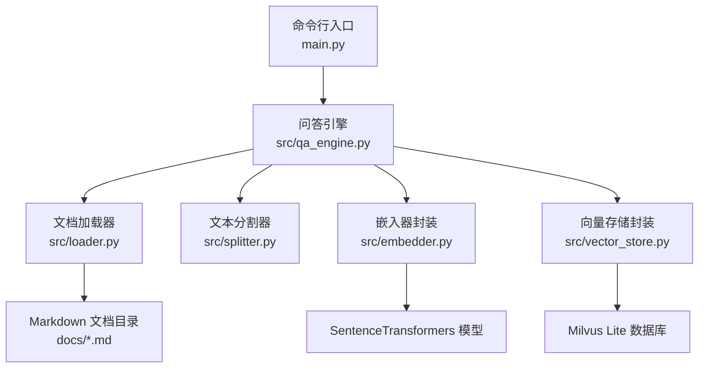
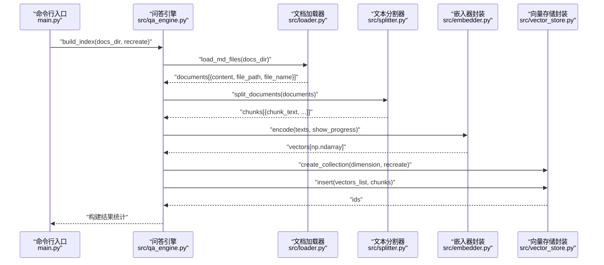
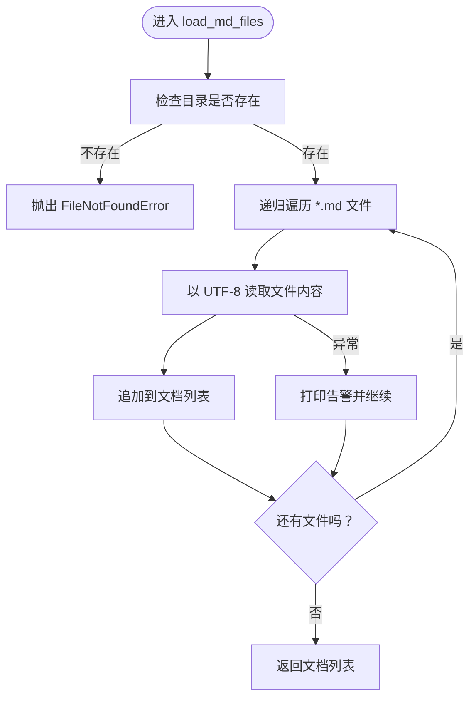
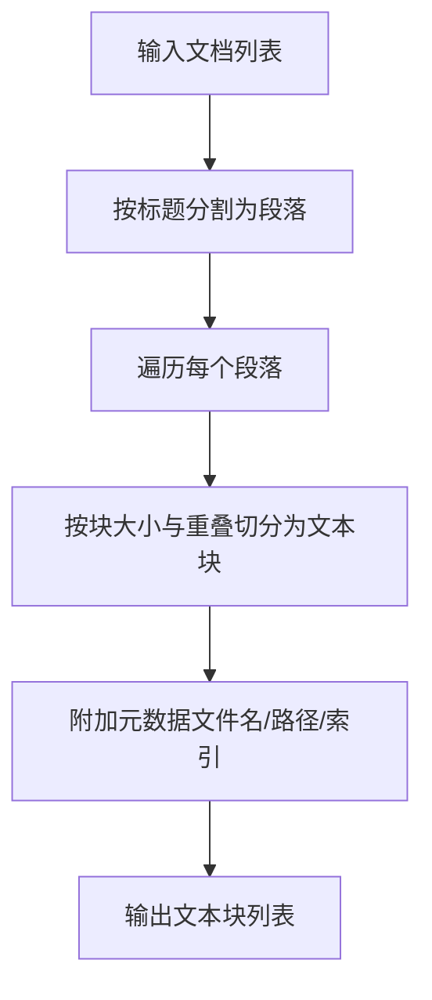
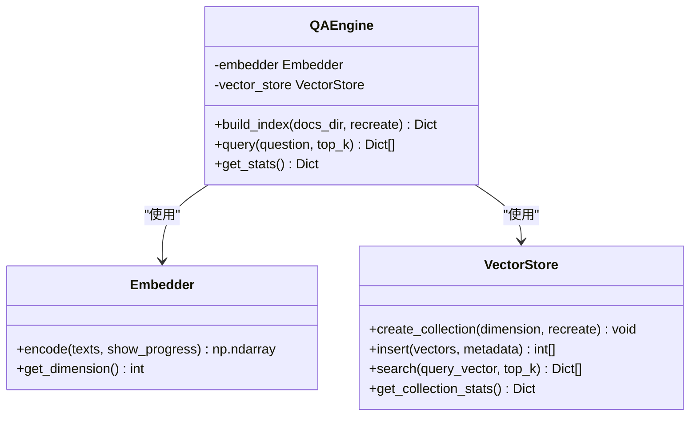
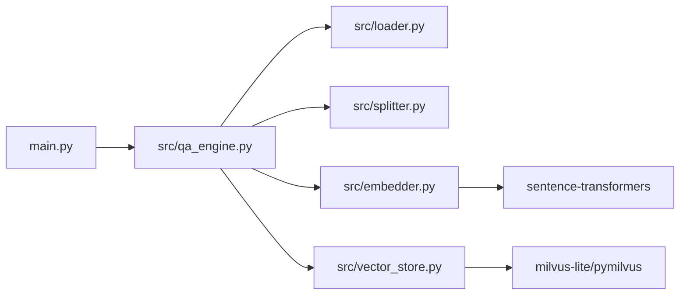

# 文档加载器

<cite>
**本文引用的文件**
- [src/loader.py](file://src/loader.py)
- [src/qa_engine.py](file://src/qa_engine.py)
- [main.py](file://main.py)
- [config.py](file://config.py)
- [src/splitter.py](file://src/splitter.py)
- [src/embedder.py](file://src/embedder.py)
- [src/vector_store.py](file://src/vector_store.py)
- [requirements.txt](file://requirements.txt)
- [docs/docker-guide.md](file://docs/docker-guide.md)
- [docs/git-guide.md](file://docs/git-guide.md)
- [docs/python-guide.md](file://docs/python-guide.md)
</cite>

## 目录
1. [简介](#简介)
2. [项目结构](#项目结构)
3. [核心组件](#核心组件)
4. [架构总览](#架构总览)
5. [详细组件分析](#详细组件分析)
6. [依赖关系分析](#依赖关系分析)
7. [性能考量](#性能考量)
8. [故障排查指南](#故障排查指南)
9. [结论](#结论)
10. [附录](#附录)

## 简介
本文档围绕“文档加载器”模块展开，系统性阐述文档扫描与加载的完整流程，包括递归目录遍历、文件过滤机制、Markdown 文件读取与解析、UTF-8 编码处理与错误恢复策略、统计信息收集方法、文件路径处理与异常处理、跨平台兼容性与性能优化等。同时提供面向实际使用的示例与最佳实践，帮助读者快速理解并正确使用该模块。

## 项目结构
该项目采用清晰的功能模块化组织方式，核心流程自上而下为：命令行入口负责参数解析与交互；问答引擎作为编排层，串联加载、分割、嵌入与向量存储；加载器负责扫描与读取 Markdown 文件；分割器负责按标题与长度进行智能分块；嵌入器负责将文本编码为向量；向量存储负责持久化与检索。

图表来源
- [main.py](file://main.py#L142-L194)
- [src/qa_engine.py](file://src/qa_engine.py#L25-L73)
- [src/loader.py](file://src/loader.py#L10-L38)
- [src/splitter.py](file://src/splitter.py#L88-L125)
- [src/embedder.py](file://src/embedder.py#L36-L58)
- [src/vector_store.py](file://src/vector_store.py#L62-L93)

章节来源
- [main.py](file://main.py#L142-L194)
- [src/qa_engine.py](file://src/qa_engine.py#L13-L24)

## 核心组件
- 文档加载器（src/loader.py）：提供递归扫描与读取 Markdown 文件的能力，并输出包含内容、绝对路径与文件名的文档列表；同时提供统计信息收集方法，汇总文件数量与字符总数。
- 文本分割器（src/splitter.py）：先按 Markdown 标题进行粗粒度分段，再按配置的块大小与重叠进行细粒度切分，保证语义完整性与检索质量。
- 问答引擎（src/qa_engine.py）：编排整个索引构建流程，调用加载器、分割器、嵌入器与向量存储，统一对外提供构建索引、查询与统计接口。
- 嵌入器封装（src/embedder.py）：封装 SentenceTransformers 模型加载与编码，支持延迟加载与批量编码。
- 向量存储封装（src/vector_store.py）：封装 Milvus Lite 的连接、集合创建、数据插入与相似度搜索，提供统计查询能力。

章节来源
- [src/loader.py](file://src/loader.py#L10-L38)
- [src/splitter.py](file://src/splitter.py#L88-L125)
- [src/qa_engine.py](file://src/qa_engine.py#L25-L73)
- [src/embedder.py](file://src/embedder.py#L36-L58)
- [src/vector_store.py](file://src/vector_store.py#L62-L93)

## 架构总览
下面以序列图形式展示“索引构建”的完整流程，从命令行入口到最终写入向量数据库。

图表来源
- [main.py](file://main.py#L24-L52)
- [src/qa_engine.py](file://src/qa_engine.py#L25-L73)
- [src/loader.py](file://src/loader.py#L10-L38)
- [src/splitter.py](file://src/splitter.py#L88-L125)
- [src/embedder.py](file://src/embedder.py#L36-L58)
- [src/vector_store.py](file://src/vector_store.py#L35-L93)

## 详细组件分析

### 文档加载器（src/loader.py）
- 递归扫描与过滤
  - 使用路径对象与递归通配符匹配，自动遍历目标目录及其子目录，仅选择扩展名为 .md 的文件。
  - 对不存在的目录抛出明确的文件不存在异常，便于上层处理。
- 文件读取与编码
  - 以 UTF-8 编码读取文件内容，确保多语言与特殊字符的正确解析。
  - 对读取异常进行捕获与告警，避免单个文件错误阻断整体流程。
- 结果结构
  - 返回包含三要素的字典列表：内容、绝对路径、文件名，便于后续处理与溯源。
- 统计信息收集
  - 提供统计方法，计算总文件数、总字符数与平均字符数，用于构建索引前的规模评估与构建后的结果展示。

图表来源
- [src/loader.py](file://src/loader.py#L10-L38)

章节来源
- [src/loader.py](file://src/loader.py#L10-L38)
- [src/loader.py](file://src/loader.py#L41-L56)

### 文本分割器（src/splitter.py）
- 标题级分段
  - 使用正则表达式识别 Markdown 标题层级，按标题进行粗粒度分段，保持语义单元完整。
- 块级切分
  - 在每个段内按配置的块大小与重叠进行切分，优先在段落或句子边界处切分，减少语义断裂。
- 输出结构
  - 为每个文本块附加来源文件名、绝对路径与块索引，便于检索后回溯原始文档位置。

图表来源
- [src/splitter.py](file://src/splitter.py#L88-L125)

章节来源
- [src/splitter.py](file://src/splitter.py#L10-L44)
- [src/splitter.py](file://src/splitter.py#L47-L85)
- [src/splitter.py](file://src/splitter.py#L88-L125)

### 问答引擎（src/qa_engine.py）
- 索引构建流程
  - 调用加载器扫描目录并读取 Markdown 文件，统计文件与字符信息。
  - 调用分割器进行分块，生成文本块列表。
  - 调用嵌入器将文本块编码为向量，维度来自配置。
  - 调用向量存储创建集合并插入向量与元数据，返回构建统计。
- 查询流程
  - 将用户问题编码为向量，调用向量存储执行相似度搜索，格式化返回结果。
- 统计查询
  - 查询集合是否存在以及记录数量，用于前端提示与流程控制。

图表来源
- [src/qa_engine.py](file://src/qa_engine.py#L13-L24)
- [src/qa_engine.py](file://src/qa_engine.py#L25-L73)
- [src/qa_engine.py](file://src/qa_engine.py#L75-L92)
- [src/qa_engine.py](file://src/qa_engine.py#L94-L101)

章节来源
- [src/qa_engine.py](file://src/qa_engine.py#L25-L73)
- [src/qa_engine.py](file://src/qa_engine.py#L75-L92)
- [src/qa_engine.py](file://src/qa_engine.py#L94-L101)

### 嵌入器封装（src/embedder.py）
- 延迟加载模型：首次使用时才加载模型，减少启动时间与内存占用。
- 批量编码：支持单个文本或文本列表，统一输出 NumPy 数组，便于向量化。
- 维度查询：提供获取向量维度的方法，便于向量存储创建集合时传参。

章节来源
- [src/embedder.py](file://src/embedder.py#L16-L34)
- [src/embedder.py](file://src/embedder.py#L36-L58)
- [src/embedder.py](file://src/embedder.py#L60-L68)

### 向量存储封装（src/vector_store.py）
- 连接管理：延迟连接 Milvus Lite，支持重复创建集合时的删除重建。
- 集合管理：创建集合时指定维度与余弦相似度度量；支持查询集合是否存在与统计记录数。
- 数据插入：将向量与元数据组装为标准格式并插入集合，返回插入 ID 列表。
- 搜索与格式化：执行相似度搜索并转换距离为相似度分数，返回包含文本与来源信息的结果列表。

章节来源
- [src/vector_store.py](file://src/vector_store.py#L35-L61)
- [src/vector_store.py](file://src/vector_store.py#L62-L93)
- [src/vector_store.py](file://src/vector_store.py#L95-L128)
- [src/vector_store.py](file://src/vector_store.py#L130-L146)

## 依赖关系分析
- 模块耦合
  - 问答引擎对加载器、分割器、嵌入器与向量存储形成直接依赖，承担编排职责。
  - 加载器与分割器相对独立，分别负责数据输入与数据预处理。
  - 嵌入器与向量存储通过接口解耦，便于替换底层实现。
- 外部依赖
  - SentenceTransformers：用于本地文本编码。
  - Milvus Lite：用于向量索引与相似度搜索。
  - Rich：用于命令行交互界面美化。

图表来源
- [src/qa_engine.py](file://src/qa_engine.py#L8-L10)
- [src/embedder.py](file://src/embedder.py#L7-L8)
- [src/vector_store.py](file://src/vector_store.py#L6-L7)
- [requirements.txt](file://requirements.txt#L1-L6)

章节来源
- [requirements.txt](file://requirements.txt#L1-L6)

## 性能考量
- 延迟加载与批处理
  - 嵌入器采用延迟加载，避免不必要的模型初始化；编码支持批量处理，提升吞吐。
- 分块策略
  - 先按标题分段，再按固定大小切分，兼顾语义完整性与检索效率；重叠有助于跨边界信息保留。
- I/O 与内存
  - 加载器以 UTF-8 读取，避免编码错误导致的重试；对异常文件仅告警并跳过，保障整体稳定性。
- 向量维度与集合
  - 通过配置统一向量维度，便于集合创建与查询；Milvus Lite 适合本地部署，降低外部依赖风险。

章节来源
- [src/embedder.py](file://src/embedder.py#L26-L34)
- [src/embedder.py](file://src/embedder.py#L36-L58)
- [src/splitter.py](file://src/splitter.py#L47-L85)
- [src/loader.py](file://src/loader.py#L28-L36)
- [src/vector_store.py](file://src/vector_store.py#L35-L61)

## 故障排查指南
- 目录不存在
  - 现象：命令行提示目录不存在。
  - 处理：确认路径拼写与权限，或使用默认 ./docs。
  - 参考
    - [main.py](file://main.py#L30-L32)
- 无 .md 文件
  - 现象：构建索引失败，提示未找到任何 .md 文件。
  - 处理：检查目录结构与扩展名是否为 .md。
  - 参考
    - [src/qa_engine.py](file://src/qa_engine.py#L42-L43)
- 文件读取异常
  - 现象：控制台打印告警，继续处理其他文件。
  - 处理：检查文件权限、编码或损坏情况。
  - 参考
    - [src/loader.py](file://src/loader.py#L35-L36)
- 索引为空
  - 现象：问答模式提示索引为空。
  - 处理：先执行索引命令，确认构建成功后再查询。
  - 参考
    - [main.py](file://main.py#L62-L65)
- 模型加载失败
  - 现象：嵌入器初始化报错。
  - 处理：检查网络与依赖安装，确保本地模型缓存可用。
  - 参考
    - [src/embedder.py](file://src/embedder.py#L30-L34)
- Milvus 连接问题
  - 现象：集合创建或插入失败。
  - 处理：检查数据库文件路径与权限，确认磁盘空间充足。
  - 参考
    - [src/vector_store.py](file://src/vector_store.py#L31-L33)

章节来源
- [main.py](file://main.py#L30-L32)
- [src/qa_engine.py](file://src/qa_engine.py#L42-L43)
- [src/loader.py](file://src/loader.py#L35-L36)
- [main.py](file://main.py#L62-L65)
- [src/embedder.py](file://src/embedder.py#L30-L34)
- [src/vector_store.py](file://src/vector_store.py#L31-L33)

## 结论
文档加载器模块通过递归扫描与 UTF-8 读取，结合错误恢复与统计信息收集，为后续的文本分割、向量编码与向量存储提供了高质量的数据输入。配合智能分块策略与延迟加载的嵌入器，整体流程在易用性、稳定性与性能之间取得良好平衡。建议在实际部署中关注目录权限、模型缓存与数据库文件路径，以获得更稳定的体验。

## 附录

### 使用示例与场景
- 建立索引
  - 命令：python main.py index --docs-dir ./docs
  - 行为：扫描 ./docs 下所有 .md 文件，构建向量索引并输出统计信息。
  - 参考
    - [main.py](file://main.py#L160-L166)
    - [src/qa_engine.py](file://src/qa_engine.py#L25-L73)
- 问答查询
  - 命令：python main.py query
  - 行为：在已有索引基础上进行语义检索，支持连续提问与退出。
  - 参考
    - [main.py](file://main.py#L169-L175)
    - [src/qa_engine.py](file://src/qa_engine.py#L75-L92)
- 查看统计
  - 命令：python main.py stats
  - 行为：显示索引是否存在与记录数量。
  - 参考
    - [main.py](file://main.py#L178-L179)
    - [src/qa_engine.py](file://src/qa_engine.py#L94-L101)

### 跨平台与兼容性
- 路径处理
  - 使用路径对象进行递归遍历与绝对路径生成，天然适配 Windows 与 Unix 风格路径。
  - 参考
    - [src/loader.py](file://src/loader.py#L20-L33)
- 编码处理
  - 统一以 UTF-8 读取，避免不同平台默认编码差异导致的乱码。
  - 参考
    - [src/loader.py](file://src/loader.py#L29)
- 依赖安装
  - 通过 requirements.txt 明确列出依赖，确保跨平台一致性。
  - 参考
    - [requirements.txt](file://requirements.txt#L1-L6)

### 大文件与性能优化建议
- 分块大小与重叠
  - 根据文档复杂度调整分块大小与重叠，平衡检索精度与性能。
  - 参考
    - [config.py](file://config.py#L19-L20)
- 延迟加载与批处理
  - 嵌入器延迟加载与批量编码，减少初始化成本与内存峰值。
  - 参考
    - [src/embedder.py](file://src/embedder.py#L26-L34)
    - [src/embedder.py](file://src/embedder.py#L36-L58)
- 异常容错
  - 对单个文件读取异常进行告警并跳过，避免影响整体构建。
  - 参考
    - [src/loader.py](file://src/loader.py#L35-L36)

### 示例目录结构
- 建议的文档目录结构如下，便于加载器递归扫描与统计：
  - docs/
    - docker-guide.md
    - git-guide.md
    - python-guide.md
  - 参考
    - [docs/docker-guide.md](file://docs/docker-guide.md#L1-L184)
    - [docs/git-guide.md](file://docs/git-guide.md#L1-L151)
    - [docs/python-guide.md](file://docs/python-guide.md#L1-L120)