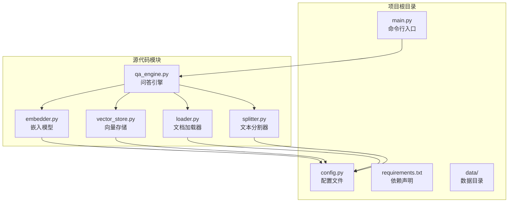
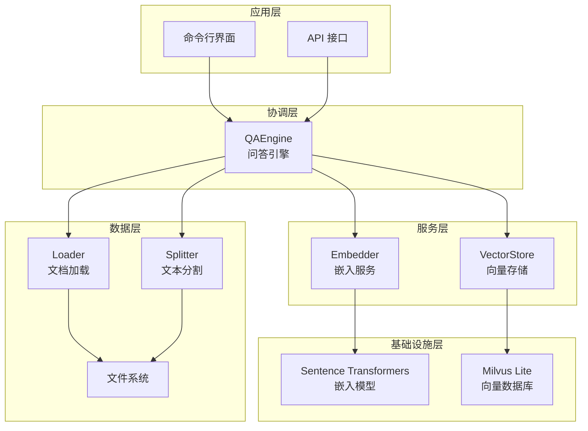
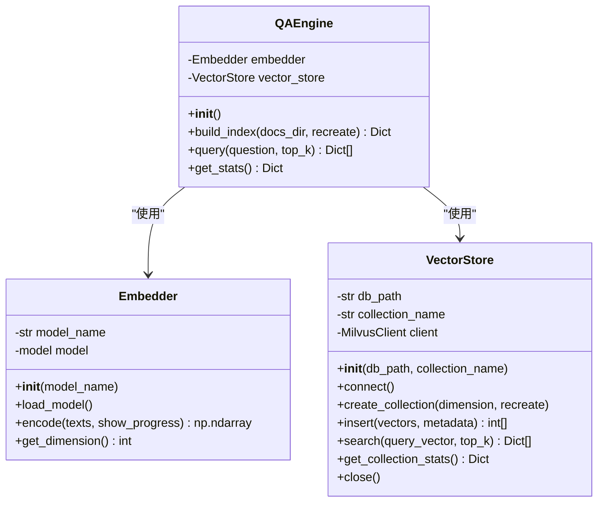
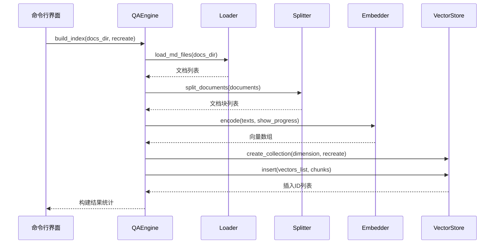
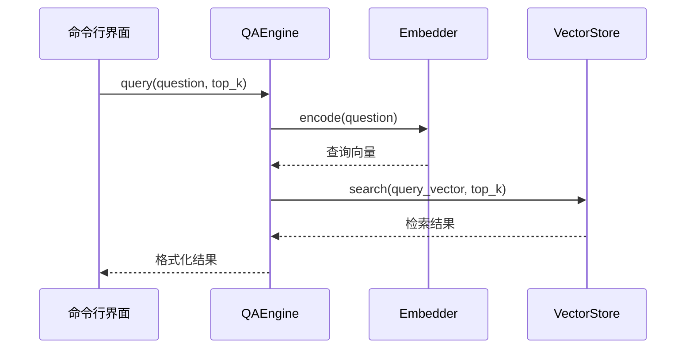
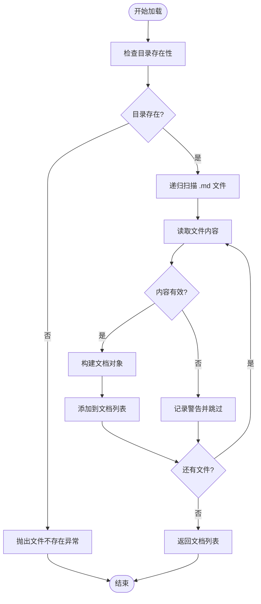
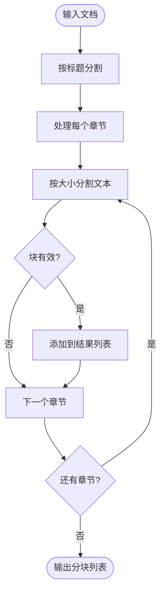
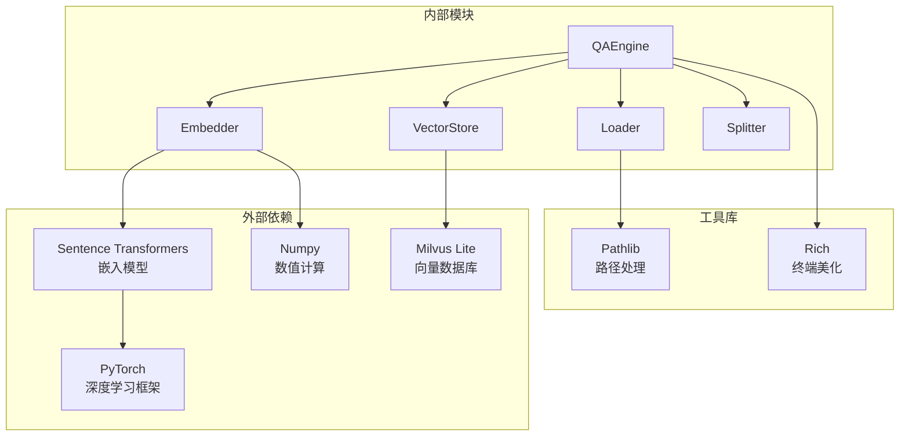
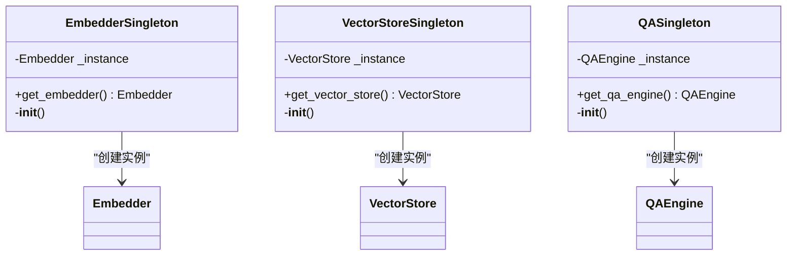
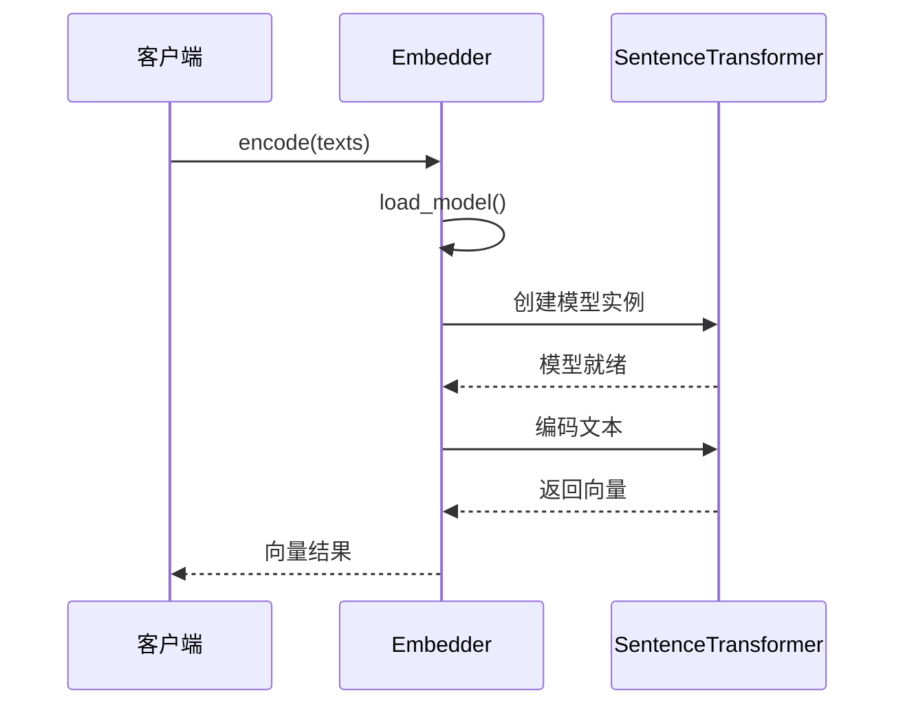

# 核心模块架构

<cite>
**本文档引用的文件**
- [src/qa_engine.py](file://src/qa_engine.py)
- [src/embedder.py](file://src/embedder.py)
- [src/vector_store.py](file://src/vector_store.py)
- [src/loader.py](file://src/loader.py)
- [src/splitter.py](file://src/splitter.py)
- [config.py](file://config.py)
- [main.py](file://main.py)
- [requirements.txt](file://requirements.txt)
</cite>

## 目录
1. [简介](#简介)
2. [项目结构](#项目结构)
3. [核心组件](#核心组件)
4. [架构概览](#架构概览)
5. [详细组件分析](#详细组件分析)
6. [依赖关系分析](#依赖关系分析)
7. [性能考量](#性能考量)
8. [故障排除指南](#故障排除指南)
9. [结论](#结论)

## 简介

这是一个基于 Milvus Lite 的本地 Markdown 语义检索知识库系统。该系统通过模块化设计实现了完整的文档处理流水线，包括文档加载、文本分割、向量嵌入、向量存储和问答检索等功能。系统采用单例模式确保资源的有效管理和共享，通过清晰的模块边界实现了高内聚低耦合的设计原则。

## 项目结构

项目采用功能模块化的组织方式，核心代码集中在 `src/` 目录下，配置信息独立于业务逻辑之外：



**图表来源**
- [main.py](file://main.py#L1-L194)
- [config.py](file://config.py#L1-L24)
- [src/qa_engine.py](file://src/qa_engine.py#L1-L119)

**章节来源**
- [main.py](file://main.py#L1-L194)
- [config.py](file://config.py#L1-L24)

## 核心组件

系统由五个核心模块组成，每个模块都有明确的职责分工：

### QAEngine - 中枢协调器
负责协调整个问答流程，作为系统的控制器和编排者。它管理其他模块的生命周期，协调数据流，并提供统一的接口给上层应用。

### Embedder - 嵌入模型封装
封装了句子嵌入模型，提供文本到向量的转换能力。支持延迟加载机制，避免不必要的内存占用。

### VectorStore - 向量数据库管理
基于 Milvus Lite 的向量存储解决方案，提供高效的相似度搜索和数据管理功能。

### Loader - 文档加载器
专门处理 Markdown 文件的递归扫描和内容读取，提供基础的数据输入能力。

### Splitter - 文本分割器
针对 Markdown 格式的智能分割算法，能够保持语义完整性的同时实现合理的块大小控制。

**章节来源**
- [src/qa_engine.py](file://src/qa_engine.py#L13-L119)
- [src/embedder.py](file://src/embedder.py#L11-L86)
- [src/vector_store.py](file://src/vector_store.py#L10-L172)
- [src/loader.py](file://src/loader.py#L10-L57)
- [src/splitter.py](file://src/splitter.py#L10-L126)

## 架构概览

系统采用分层架构设计，从底层基础设施到上层应用服务形成清晰的层次结构：



**图表来源**
- [src/qa_engine.py](file://src/qa_engine.py#L13-L119)
- [src/embedder.py](file://src/embedder.py#L11-L86)
- [src/vector_store.py](file://src/vector_store.py#L10-L172)
- [src/loader.py](file://src/loader.py#L10-L57)
- [src/splitter.py](file://src/splitter.py#L10-L126)

## 详细组件分析

### QAEngine - 问答引擎

QAEngine 是整个系统的核心协调器，负责管理完整的问答工作流程：



**图表来源**
- [src/qa_engine.py](file://src/qa_engine.py#L13-L119)
- [src/embedder.py](file://src/embedder.py#L11-L86)
- [src/vector_store.py](file://src/vector_store.py#L10-L172)

#### 核心工作流程

**索引构建流程**：


**查询流程**：


**章节来源**
- [src/qa_engine.py](file://src/qa_engine.py#L25-L92)

### Embedder - 嵌入模型封装

Embedder 模块提供了灵活的嵌入模型管理能力：

```mermaid
classDiagram
class Embedder {
-str model_name
-SentenceTransformer model
+__init__(model_name)
+load_model()
+encode(texts, show_progress) np.ndarray
+get_dimension() int
}
note for Embedder : "支持延迟加载<br/>避免内存浪费"
note for Embedder : "统一的编码接口<br/>支持单个和批量处理"
```

**图表来源**
- [src/embedder.py](file://src/embedder.py#L11-L86)

#### 设计特点

1. **延迟加载机制**：只有在实际需要时才加载模型，减少启动时间
2. **统一接口**：支持字符串和列表两种输入格式
3. **进度显示**：可选的进度条显示，提升用户体验
4. **维度查询**：动态获取向量维度信息

**章节来源**
- [src/embedder.py](file://src/embedder.py#L26-L68)

### VectorStore - 向量数据库管理

VectorStore 提供了完整的向量数据管理功能：

```mermaid
classDiagram
class VectorStore {
-str db_path
-str collection_name
-MilvusClient client
+__init__(db_path, collection_name)
+connect()
+create_collection(dimension, recreate)
+insert(vectors, metadata) int[]
+search(query_vector, top_k) Dict[]
+get_collection_stats() Dict
+close()
}
note for VectorStore : "基于 Milvus Lite<br/>纯 Python 实现"
note for VectorStore : "支持集合管理<br/>数据增删改查"
note for VectorStore : "相似度搜索<br/>余弦距离计算"
```

**图表来源**
- [src/vector_store.py](file://src/vector_store.py#L10-L172)

#### 核心功能

1. **集合管理**：创建、删除和检查集合的存在性
2. **数据插入**：批量插入向量和元数据
3. **相似度搜索**：基于余弦相似度的高效检索
4. **统计查询**：获取集合状态和数据量信息

**章节来源**
- [src/vector_store.py](file://src/vector_store.py#L35-L146)

### Loader - 文档加载器

Loader 模块专注于 Markdown 文件的处理：



**图表来源**
- [src/loader.py](file://src/loader.py#L10-L57)

**章节来源**
- [src/loader.py](file://src/loader.py#L10-L57)

### Splitter - 文本分割器

Splitter 实现了针对 Markdown 的智能分割算法：



**图表来源**
- [src/splitter.py](file://src/splitter.py#L88-L126)

#### 分割策略

1. **层次化分割**：首先按 Markdown 标题进行语义分割
2. **智能截断**：在句子边界处进行截断，保持语义完整性
3. **重叠处理**：相邻块之间设置重叠，提高检索准确性
4. **索引维护**：为每个分块维护原始文件信息和位置索引

**章节来源**
- [src/splitter.py](file://src/splitter.py#L47-L125)

## 依赖关系分析

系统采用松耦合的设计，通过清晰的接口定义实现模块间的通信：



**图表来源**
- [requirements.txt](file://requirements.txt#L1-L6)
- [src/qa_engine.py](file://src/qa_engine.py#L5-L10)
- [src/embedder.py](file://src/embedder.py#L6-L8)
- [src/vector_store.py](file://src/vector_store.py#L6-L7)

### 设计模式应用

系统中应用了多种设计模式来提升代码质量和可维护性：

#### 单例模式
所有核心服务都实现了单例模式，确保全局唯一性和资源管理：



**图表来源**
- [src/embedder.py](file://src/embedder.py#L71-L86)
- [src/vector_store.py](file://src/vector_store.py#L157-L172)
- [src/qa_engine.py](file://src/qa_engine.py#L104-L119)

#### 延迟加载模式
Embedder 和 VectorStore 都实现了延迟加载，只有在首次使用时才初始化：



**图表来源**
- [src/embedder.py](file://src/embedder.py#L26-L58)

**章节来源**
- [src/embedder.py](file://src/embedder.py#L71-L86)
- [src/vector_store.py](file://src/vector_store.py#L157-L172)
- [src/qa_engine.py](file://src/qa_engine.py#L104-L119)

## 性能考量

### 内存优化
- **延迟加载**：嵌入模型和向量数据库连接只在需要时建立
- **批量处理**：支持批量向量化和批量插入，减少 I/O 操作
- **内存映射**：Milvus Lite 支持内存映射文件，降低内存占用

### 计算优化
- **向量化操作**：利用 NumPy 进行高效的向量计算
- **缓存机制**：模型权重和中间结果的合理缓存
- **并行处理**：支持多线程的向量化编码

### 存储优化
- **增量更新**：支持增量索引构建，避免全量重建
- **压缩存储**：向量数据的压缩存储策略
- **索引选择**：根据数据规模选择合适的索引类型

## 故障排除指南

### 常见问题及解决方案

#### 模型加载失败
**症状**：嵌入模型无法加载
**原因**：网络连接问题或模型文件损坏
**解决**：检查网络连接，重新下载模型文件

#### 向量数据库连接失败
**症状**：无法连接到 Milvus Lite
**原因**：数据库文件权限问题或磁盘空间不足
**解决**：检查文件权限和磁盘空间

#### 文档加载异常
**症状**：某些 Markdown 文件读取失败
**原因**：文件编码问题或文件损坏
**解决**：检查文件编码格式，修复损坏文件

#### 搜索结果不准确
**症状**：检索结果质量不佳
**原因**：模型选择不当或参数配置不合理
**解决**：调整嵌入模型或修改分割参数

**章节来源**
- [src/loader.py](file://src/loader.py#L23-L37)
- [src/embedder.py](file://src/embedder.py#L30-L34)
- [src/vector_store.py](file://src/vector_store.py#L31-L33)

## 结论

该系统通过精心设计的模块化架构实现了高效的本地知识库解决方案。核心优势包括：

1. **清晰的职责分离**：每个模块都有明确的功能边界
2. **灵活的扩展性**：支持不同类型的嵌入模型和向量数据库
3. **良好的性能表现**：通过延迟加载和批量处理优化资源使用
4. **易于维护**：模块间松耦合，便于单独测试和升级

系统采用的单例模式和延迟加载机制确保了资源的有效管理，而分层架构设计为未来的功能扩展奠定了坚实基础。通过合理的配置管理和错误处理机制，系统能够在各种环境下稳定运行。