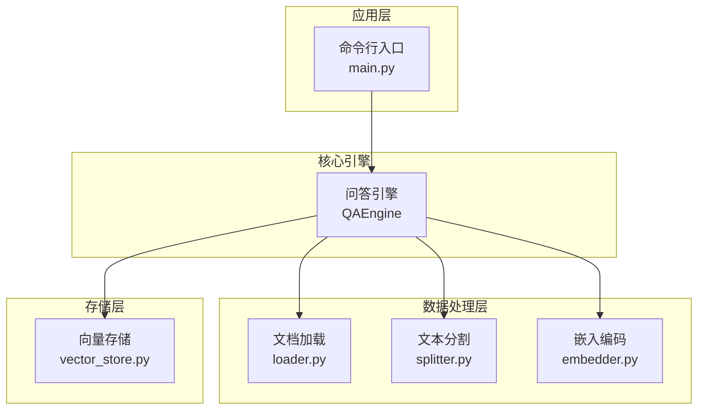
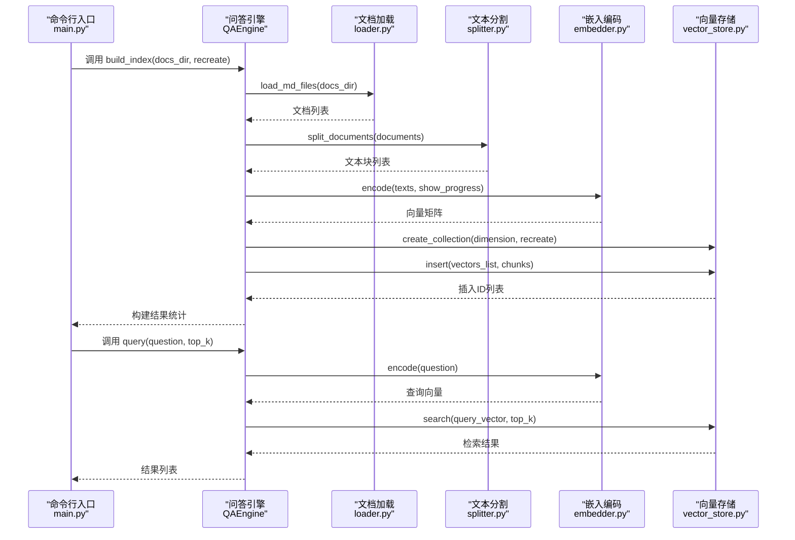
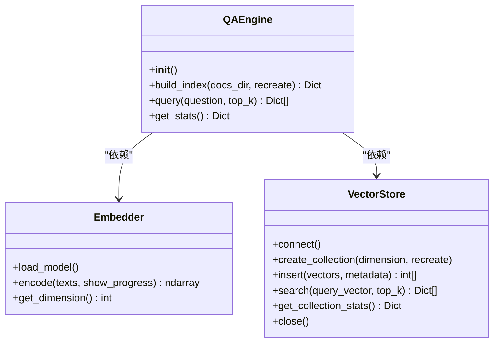
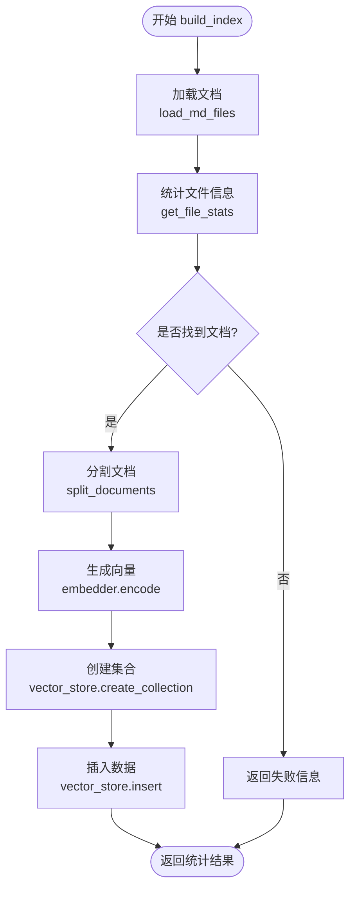
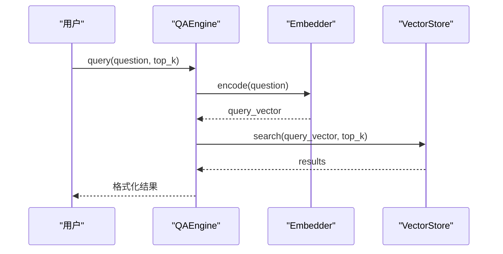
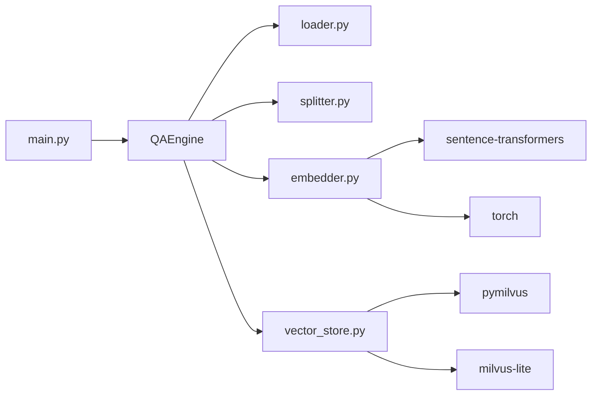

# 问答引擎核心

<cite>
**本文引用的文件**
- [src/qa_engine.py](file://src/qa_engine.py)
- [src/embedder.py](file://src/embedder.py)
- [src/loader.py](file://src/loader.py)
- [src/splitter.py](file://src/splitter.py)
- [src/vector_store.py](file://src/vector_store.py)
- [config.py](file://config.py)
- [main.py](file://main.py)
- [requirements.txt](file://requirements.txt)
</cite>

## 目录
1. [简介](#简介)
2. [项目结构](#项目结构)
3. [核心组件](#核心组件)
4. [架构总览](#架构总览)
5. [详细组件分析](#详细组件分析)
6. [依赖关系分析](#依赖关系分析)
7. [性能考量](#性能考量)
8. [故障排查指南](#故障排查指南)
9. [结论](#结论)
10. [附录](#附录)

## 简介
本文件面向“问答引擎核心模块”，聚焦以下目标：
- 解释 QAEngine 类的设计理念与实现细节，阐明其作为系统中枢协调器的角色
- 详述 build_index 方法的完整索引构建流程：文档加载、分割、向量生成、集合创建与数据插入
- 解释 query 方法的查询处理机制：问题向量化与相似度搜索
- 阐述 get_stats 方法的统计信息获取功能
- 说明全局单例模式的实现与优势
- 提供使用示例、最佳实践、错误处理与性能优化建议

## 项目结构
该项目采用模块化设计，围绕“文档加载—文本分割—向量编码—向量存储—查询检索”五步流程组织代码。核心模块如下：
- src/qa_engine.py：问答引擎中枢，协调各子模块
- src/loader.py：递归扫描并读取 Markdown 文档
- src/splitter.py：基于标题与长度的智能分块策略
- src/embedder.py：SentenceTransformer 封装与延迟加载
- src/vector_store.py：Milvus Lite 封装与 CRUD、检索、统计
- config.py：全局配置（模型、向量维度、Milvus、分块、Top-K）
- main.py：命令行入口，提供 index/query/stats 三类命令
- requirements.txt：依赖声明

图表来源
- [main.py](file://main.py#L142-L194)
- [src/qa_engine.py](file://src/qa_engine.py#L13-L119)
- [src/loader.py](file://src/loader.py#L10-L57)
- [src/splitter.py](file://src/splitter.py#L88-L126)
- [src/embedder.py](file://src/embedder.py#L11-L86)
- [src/vector_store.py](file://src/vector_store.py#L10-L172)

章节来源
- [main.py](file://main.py#L142-L194)
- [config.py](file://config.py#L1-L24)

## 核心组件
- QAEngine：系统中枢，负责编排构建索引与执行查询的全流程；提供 get_stats 获取统计信息；通过全局单例对外提供实例
- Embedder：封装 SentenceTransformer，支持延迟加载与批量编码
- VectorStore：封装 Milvus Lite，提供集合创建、插入、搜索与统计
- Loader：递归扫描目录，读取 Markdown 文档并统计基础信息
- Splitter：先按标题切分，再按长度与句号等边界切分，保证语义完整性与上下文连续性
- Config：集中管理模型、向量维度、Milvus、分块与 Top-K 等参数

章节来源
- [src/qa_engine.py](file://src/qa_engine.py#L13-L119)
- [src/embedder.py](file://src/embedder.py#L11-L86)
- [src/vector_store.py](file://src/vector_store.py#L10-L172)
- [src/loader.py](file://src/loader.py#L10-L57)
- [src/splitter.py](file://src/splitter.py#L88-L126)
- [config.py](file://config.py#L1-L24)

## 架构总览
下图展示 QAEngine 如何协调各子模块完成“索引构建—查询检索”的端到端流程，并体现全局单例模式的使用方式。

图表来源
- [src/qa_engine.py](file://src/qa_engine.py#L25-L92)
- [src/loader.py](file://src/loader.py#L10-L38)
- [src/splitter.py](file://src/splitter.py#L88-L126)
- [src/embedder.py](file://src/embedder.py#L36-L58)
- [src/vector_store.py](file://src/vector_store.py#L35-L94)

## 详细组件分析

### QAEngine 类与全局单例
- 设计理念
  - 作为系统中枢协调器：统一调度加载、分割、编码、存储与检索
  - 通过 get_qa_engine 提供全局单例，避免重复初始化与资源浪费
- 关键方法
  - build_index：构建索引的完整流程
  - query：问题向量化后相似度搜索
  - get_stats：获取集合统计信息
- 单例实现
  - 私有变量保存唯一实例，首次调用时创建，后续复用

图表来源
- [src/qa_engine.py](file://src/qa_engine.py#L13-L119)
- [src/embedder.py](file://src/embedder.py#L11-L86)
- [src/vector_store.py](file://src/vector_store.py#L10-L172)

章节来源
- [src/qa_engine.py](file://src/qa_engine.py#L13-L119)

### build_index 方法：索引构建全流程
- 步骤分解
  1) 文档加载：递归扫描目录，读取 Markdown 文件，统计文件数与字符数
  2) 文本分割：先按标题切分，再按长度与句号等边界切分，保留语义完整性
  3) 向量生成：批量编码文本块，输出向量矩阵并打印维度
  4) 集合创建：连接 Milvus，按需删除旧集合，创建新集合（余弦相似度）
  5) 数据插入：构造包含 chunk_text、source_file、file_path、chunk_index 的实体，插入向量与元数据
- 返回值：包含成功标志、文件数、文本块数、向量维度的统计字典

图表来源
- [src/qa_engine.py](file://src/qa_engine.py#L25-L73)
- [src/loader.py](file://src/loader.py#L10-L38)
- [src/splitter.py](file://src/splitter.py#L88-L126)
- [src/embedder.py](file://src/embedder.py#L36-L58)
- [src/vector_store.py](file://src/vector_store.py#L35-L94)

章节来源
- [src/qa_engine.py](file://src/qa_engine.py#L25-L73)

### query 方法：查询处理机制
- 处理流程
  1) 将用户问题编码为向量
  2) 在 Milvus 中执行相似度搜索，返回包含相似度分数与元数据的结果
- 输出格式：包含 id、score、text、source_file、file_path、chunk_index 的结果列表

图表来源
- [src/qa_engine.py](file://src/qa_engine.py#L75-L92)
- [src/embedder.py](file://src/embedder.py#L36-L58)
- [src/vector_store.py](file://src/vector_store.py#L95-L128)

章节来源
- [src/qa_engine.py](file://src/qa_engine.py#L75-L92)

### get_stats 方法：统计信息获取
- 功能：检查集合是否存在并返回当前文档块数量
- 返回值：包含 exists 与 count 的字典

章节来源
- [src/qa_engine.py](file://src/qa_engine.py#L94-L101)
- [src/vector_store.py](file://src/vector_store.py#L130-L146)

### 全局单例模式：实现与优势
- 实现：每个核心模块均提供 get_xxx() 函数，内部维护私有实例变量，首次调用创建，后续直接返回
- 优势：
  - 避免重复初始化开销（如模型加载、数据库连接）
  - 统一资源管理，便于缓存与复用
  - 降低耦合，简化跨模块调用

章节来源
- [src/qa_engine.py](file://src/qa_engine.py#L104-L119)
- [src/embedder.py](file://src/embedder.py#L71-L86)
- [src/vector_store.py](file://src/vector_store.py#L157-L172)

## 依赖关系分析
- 模块内聚与耦合
  - QAEngine 高内聚地协调 loader、splitter、embedder、vector_store 四个模块
  - 各模块职责清晰，耦合通过接口（函数/方法）传递，无循环依赖
- 外部依赖
  - sentence-transformers：本地模型加载与编码
  - pymilvus 与 milvus-lite：向量数据库客户端与本地实现
  - torch：模型推理后端
  - rich：命令行交互与可视化

图表来源
- [src/qa_engine.py](file://src/qa_engine.py#L5-L10)
- [src/embedder.py](file://src/embedder.py#L7-L8)
- [src/vector_store.py](file://src/vector_store.py#L6-L7)
- [requirements.txt](file://requirements.txt#L1-L6)

章节来源
- [requirements.txt](file://requirements.txt#L1-L6)

## 性能考量
- 向量维度与模型选择
  - 配置文件中定义了向量维度与模型名称，不同模型在精度与体积上权衡
  - 建议根据硬件条件与召回质量需求选择合适模型
- 文本分块策略
  - 先按标题切分，再按长度与句号等边界切分，兼顾语义完整性与检索粒度
  - CHUNK_SIZE 与 CHUNK_OVERLAP 影响召回与冗余，应结合文档特性调整
- 批量编码与插入
  - build_index 中对文本块进行批量编码，减少模型调用次数
  - 插入时将 numpy 数组转为列表，确保 Milvus 客户端可接受的数据类型
- 检索参数
  - TOP_K 控制返回结果数量，影响响应时间与召回质量
- I/O 与磁盘
  - Milvus Lite 将数据持久化至本地文件，注意磁盘空间与写入性能

章节来源
- [config.py](file://config.py#L5-L24)
- [src/splitter.py](file://src/splitter.py#L47-L85)
- [src/qa_engine.py](file://src/qa_engine.py#L50-L66)
- [src/vector_store.py](file://src/vector_store.py#L62-L94)

## 故障排查指南
- 目录不存在
  - 现象：加载阶段抛出异常
  - 处理：确认 docs_dir 路径存在且可读
- 未找到任何 md 文件
  - 现象：build_index 返回失败信息
  - 处理：检查目录结构与文件扩展名
- 索引为空
  - 现象：query 前统计 count 为 0
  - 处理：先执行 index 命令建立索引
- 模型加载失败
  - 现象：首次编码时报错
  - 处理：确认网络可访问模型仓库或本地已有模型缓存
- Milvus 连接问题
  - 现象：创建集合或插入失败
  - 处理：检查数据库路径权限与磁盘空间

章节来源
- [src/loader.py](file://src/loader.py#L23-L37)
- [src/qa_engine.py](file://src/qa_engine.py#L42-L43)
- [main.py](file://main.py#L60-L65)
- [src/embedder.py](file://src/embedder.py#L30-L34)
- [src/vector_store.py](file://src/vector_store.py#L31-L33)

## 结论
本问答引擎以 QAEngine 为核心，通过模块化设计实现了从文档加载、文本分割、向量编码到向量存储与检索的完整链路。全局单例模式降低了资源消耗并提升了易用性。配合合理的分块策略与检索参数，可在本地环境下高效构建与使用语义检索知识库。

## 附录

### 使用示例与最佳实践
- 建立索引
  - 命令：python main.py index --docs-dir ./docs
  - 最佳实践：首次建立索引时设置 recreate=True；定期增量更新时谨慎评估重建成本
- 问答查询
  - 命令：python main.py query --top-k 5
  - 最佳实践：根据业务场景调整 top-k；对长文本截断显示以提升可读性
- 查看统计
  - 命令：python main.py stats
  - 最佳实践：定期检查索引状态与文档块数量，监控增长趋势
- 错误处理
  - 建议在生产环境捕获并记录异常，向用户提供明确提示
- 性能优化
  - 选择合适的模型与维度
  - 调整分块大小与重叠，平衡召回与冗余
  - 批量插入与查询，减少 I/O 次数

章节来源
- [main.py](file://main.py#L24-L123)
- [config.py](file://config.py#L18-L24)