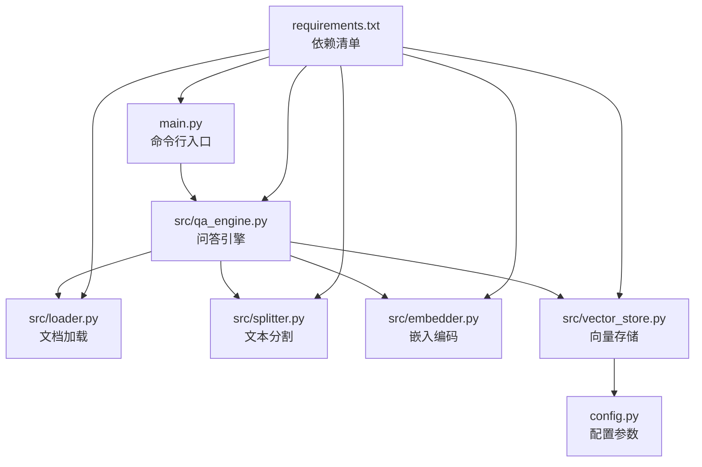
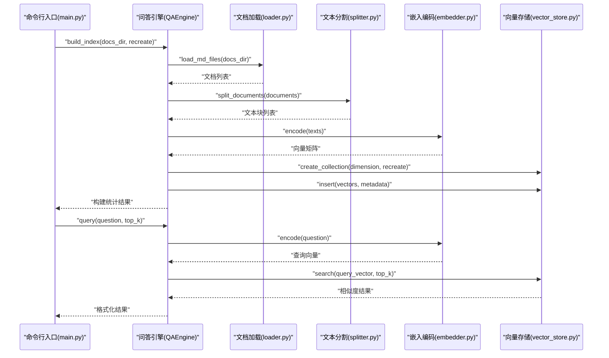
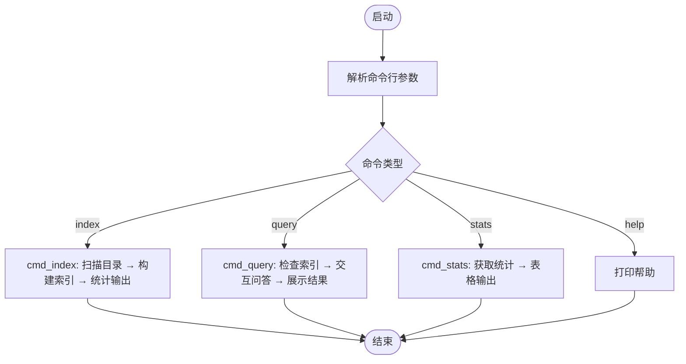
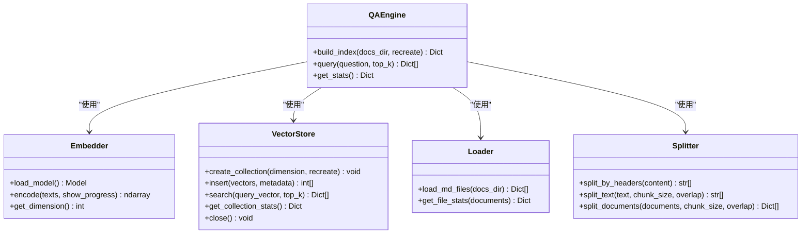
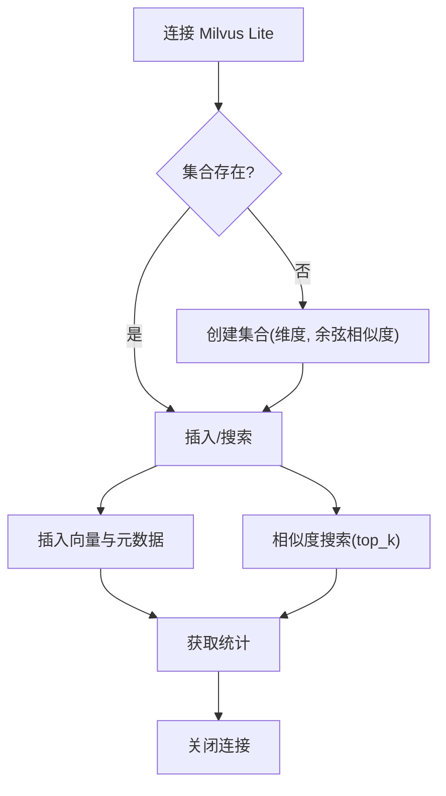
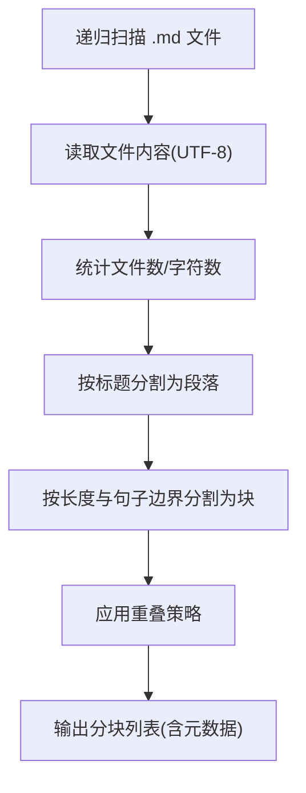
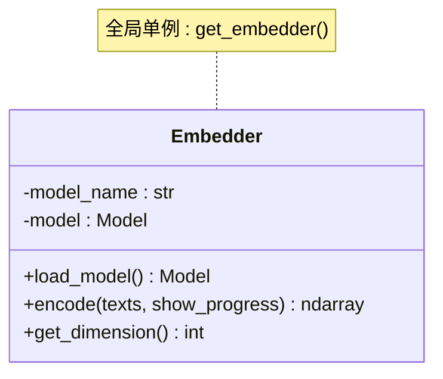
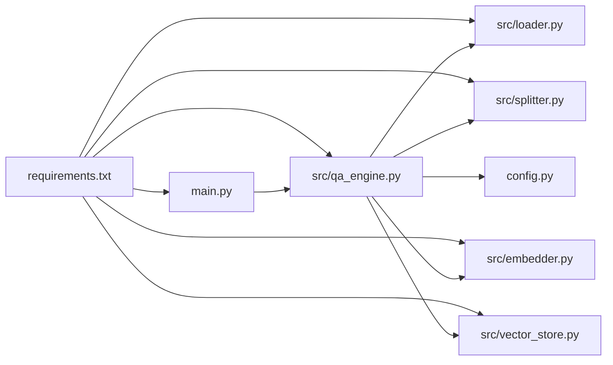

# 部署与运维

<cite>
**本文引用的文件**
- [requirements.txt](file://requirements.txt)
- [config.py](file://config.py)
- [main.py](file://main.py)
- [docs/docker-guide.md](file://docs/docker-guide.md)
- [docs/git-guide.md](file://docs/git-guide.md)
- [docs/python-guide.md](file://docs/python-guide.md)
- [src/__init__.py](file://src/__init__.py)
- [src/embedder.py](file://src/embedder.py)
- [src/loader.py](file://src/loader.py)
- [src/splitter.py](file://src/splitter.py)
- [src/vector_store.py](file://src/vector_store.py)
- [src/qa_engine.py](file://src/qa_engine.py)
</cite>

## 目录
1. [简介](#简介)
2. [项目结构](#项目结构)
3. [核心组件](#核心组件)
4. [架构总览](#架构总览)
5. [详细组件分析](#详细组件分析)
6. [依赖关系分析](#依赖关系分析)
7. [性能考虑](#性能考虑)
8. [故障排除指南](#故障排除指南)
9. [结论](#结论)
10. [附录](#附录)

## 简介
本指南面向从开发到生产的完整生命周期管理，覆盖生产环境部署（Docker 容器化与传统环境）、Git 工作流程（分支管理、版本发布、协作最佳实践）、Python 环境与依赖管理策略、性能监控与日志管理、故障排除与维护、备份恢复与数据安全、扩展性规划与容量管理等关键主题。该知识库系统基于本地 Milvus Lite 向量数据库，提供基于嵌入模型的语义检索能力，适合在本地或受控环境中部署与运维。

## 项目结构
项目采用模块化组织，核心逻辑集中在 src 目录，入口脚本位于根目录，配置集中于 config.py，依赖通过 requirements.txt 管理。文档目录 docs 提供 Docker、Git、Python 的参考指南。

图表来源
- [main.py](file://main.py#L1-L194)
- [src/qa_engine.py](file://src/qa_engine.py#L1-L119)
- [src/loader.py](file://src/loader.py#L1-L57)
- [src/splitter.py](file://src/splitter.py#L1-L126)
- [src/embedder.py](file://src/embedder.py#L1-L86)
- [src/vector_store.py](file://src/vector_store.py#L1-L172)
- [config.py](file://config.py#L1-L24)
- [requirements.txt](file://requirements.txt#L1-L6)

章节来源
- [main.py](file://main.py#L1-L194)
- [config.py](file://config.py#L1-L24)
- [requirements.txt](file://requirements.txt#L1-L6)

## 核心组件
- 嵌入编码器：负责将文本编码为向量，支持延迟加载与进度显示。
- 文档加载器：递归扫描指定目录下的 Markdown 文件并统计信息。
- 文本分割器：按标题与字符长度进行智能分块，支持重叠与句子边界分割。
- 向量存储：基于 Milvus Lite 的本地向量数据库封装，支持创建集合、插入向量、相似度搜索与统计查询。
- 问答引擎：整合上述组件，提供索引构建与查询接口，并以全局单例模式提供访问。
- 命令行入口：提供 index、query、stats 三个子命令，支持交互式问答与统计查看。

章节来源
- [src/embedder.py](file://src/embedder.py#L1-L86)
- [src/loader.py](file://src/loader.py#L1-L57)
- [src/splitter.py](file://src/splitter.py#L1-L126)
- [src/vector_store.py](file://src/vector_store.py#L1-L172)
- [src/qa_engine.py](file://src/qa_engine.py#L1-L119)
- [main.py](file://main.py#L1-L194)

## 架构总览
系统采用“文档加载 → 文本分割 → 向量编码 → 向量存储”的流水线式架构；查询时将问题编码为向量后在 Milvus Lite 中进行相似度检索，返回带相似度分数的结果。

图表来源
- [main.py](file://main.py#L24-L123)
- [src/qa_engine.py](file://src/qa_engine.py#L25-L92)
- [src/loader.py](file://src/loader.py#L10-L38)
- [src/splitter.py](file://src/splitter.py#L88-L125)
- [src/embedder.py](file://src/embedder.py#L36-L58)
- [src/vector_store.py](file://src/vector_store.py#L95-L128)

## 详细组件分析

### 命令行入口与子命令
- index：扫描指定目录，构建索引并输出统计信息。
- query：交互式问答，检查索引状态并在空索引时给出提示。
- stats：展示集合存在状态与文档块数量。

图表来源
- [main.py](file://main.py#L142-L189)

章节来源
- [main.py](file://main.py#L24-L123)
- [main.py](file://main.py#L142-L189)

### 问答引擎与数据流
- build_index：加载文档 → 分割 → 编码 → 创建集合 → 插入 → 统计。
- query：编码问题 → 搜索 → 格式化结果。
- get_stats：查询集合统计。

图表来源
- [src/qa_engine.py](file://src/qa_engine.py#L13-L101)
- [src/embedder.py](file://src/embedder.py#L11-L85)
- [src/vector_store.py](file://src/vector_store.py#L10-L154)
- [src/loader.py](file://src/loader.py#L10-L56)
- [src/splitter.py](file://src/splitter.py#L10-L125)

章节来源
- [src/qa_engine.py](file://src/qa_engine.py#L25-L101)

### 向量存储与 Milvus Lite
- 连接与集合管理：延迟连接、存在性检查、重建选项。
- 插入：构造包含文本与元数据的数据项并批量插入。
- 搜索：相似度检索并转换距离为相似度分数。
- 统计：查询集合行数与存在状态。

图表来源
- [src/vector_store.py](file://src/vector_store.py#L27-L154)

章节来源
- [src/vector_store.py](file://src/vector_store.py#L35-L154)

### 文档加载与分割
- 递归扫描 .md 文件，读取 UTF-8 内容并统计信息。
- 按标题分割文档，再按字符长度与句子边界进行分块，支持重叠。

图表来源
- [src/loader.py](file://src/loader.py#L10-L56)
- [src/splitter.py](file://src/splitter.py#L10-L125)

章节来源
- [src/loader.py](file://src/loader.py#L10-L56)
- [src/splitter.py](file://src/splitter.py#L47-L125)

### 嵌入编码器
- 延迟加载模型，支持单文本或多文本编码。
- 返回 NumPy 数组，便于后续转换为列表写入数据库。

图表来源
- [src/embedder.py](file://src/embedder.py#L11-L85)

章节来源
- [src/embedder.py](file://src/embedder.py#L26-L68)

## 依赖关系分析
- 运行时依赖：pymilvus、milvus-lite、sentence-transformers、torch、rich。
- 配置依赖：config.py 中的模型、向量维度、数据库路径、集合名、分块参数、检索参数。
- 模块依赖：main.py 依赖 qa_engine；qa_engine 依赖 loader、splitter、embedder、vector_store。

图表来源
- [main.py](file://main.py#L17-L18)
- [src/qa_engine.py](file://src/qa_engine.py#L6-L10)
- [requirements.txt](file://requirements.txt#L1-L6)

章节来源
- [requirements.txt](file://requirements.txt#L1-L6)
- [config.py](file://config.py#L5-L23)

## 性能考虑
- 模型加载与编码
  - 嵌入模型采用延迟加载，避免启动即占用内存；建议在构建索引前预热模型以减少首次耗时。
  - 编码时启用进度显示，便于观察大规模文档处理进度。
- 文本分割
  - 分块大小与重叠需平衡检索精度与存储/查询成本；较大的重叠有助于上下文连续性，但会增加存储与向量数量。
  - 按标题分割可提升语义连贯性，建议优先保留标题层级信息。
- 向量存储
  - Milvus Lite 为本地嵌入式数据库，适合中小规模数据；若数据量增长显著，建议评估迁移至远程 Milvus 或云向量服务。
  - 余弦相似度度量适合高维稀疏向量；注意向量维度与硬件内存匹配。
- 查询性能
  - top_k 参数影响召回数量与响应时间；建议在生产环境根据 SLA 调整。
  - 对频繁查询的问题可考虑缓存热门问题的向量表示，减少重复编码。

章节来源
- [src/embedder.py](file://src/embedder.py#L26-L58)
- [src/splitter.py](file://src/splitter.py#L47-L85)
- [src/vector_store.py](file://src/vector_store.py#L95-L128)
- [config.py](file://config.py#L18-L23)

## 故障排除指南
- 索引为空或未建立
  - 现象：查询前未建立索引，系统提示索引为空。
  - 处理：先执行索引命令，确认文档目录存在且包含 .md 文件。
- 文档读取异常
  - 现象：读取文件时报错或跳过某些文件。
  - 处理：检查文件编码是否为 UTF-8，确认文件权限与路径正确。
- 向量维度不匹配
  - 现象：创建集合或插入向量时报维度错误。
  - 处理：确保嵌入模型维度与配置一致；重建索引时选择 recreate 以清理旧集合。
- 查询无结果
  - 现象：问题无法匹配到相关文档块。
  - 处理：降低 top_k，调整分块大小与重叠，或更换更合适的嵌入模型。
- Milvus Lite 连接问题
  - 现象：连接失败或数据库文件损坏。
  - 处理：检查数据库路径权限，必要时删除旧数据库文件并重建索引。

章节来源
- [main.py](file://main.py#L60-L65)
- [src/loader.py](file://src/loader.py#L23-L36)
- [src/vector_store.py](file://src/vector_store.py#L35-L60)
- [src/qa_engine.py](file://src/qa_engine.py#L75-L92)

## 结论
本指南提供了从开发到生产的全栈运维实践：明确的部署路径（Docker 与传统环境）、规范的 Git 工作流、可控的 Python 环境与依赖管理、可操作的性能优化与故障排除策略，以及面向未来的扩展与容量规划建议。结合本地 Milvus Lite 的轻量特性，可在受控环境中快速落地语义检索知识库，并为后续规模化演进奠定基础。

## 附录

### 生产环境部署指南

- Docker 容器化部署
  - 基础镜像与工作目录：使用官方 Python 基础镜像，设置工作目录，复制依赖与应用代码。
  - 依赖安装：使用 requirements.txt 安装运行时依赖。
  - 端口暴露与启动：根据需要暴露端口并设置 CMD 启动命令。
  - 最佳实践：使用 .dockerignore 排除不必要的文件，避免在镜像中存储敏感信息，为容器设置资源限制。
  
  章节来源
  - [docs/docker-guide.md](file://docs/docker-guide.md#L100-L123)
  - [docs/docker-guide.md](file://docs/docker-guide.md#L159-L174)
  - [docs/docker-guide.md](file://docs/docker-guide.md#L176-L184)
  - [requirements.txt](file://requirements.txt#L1-L6)

- 传统环境部署
  - Python 环境：确保 Python 版本满足依赖要求，推荐使用虚拟环境隔离依赖。
  - 依赖安装：pip 安装 requirements.txt 中列出的包。
  - 运行方式：直接运行命令行入口，或在 systemd/cron 等服务管理器中配置定时任务。
  
  章节来源
  - [docs/python-guide.md](file://docs/python-guide.md#L12-L39)
  - [requirements.txt](file://requirements.txt#L1-L6)
  - [main.py](file://main.py#L142-L189)

### Git 工作流程与协作

- 分支管理
  - Git Flow：主分支用于稳定版本，develop 日常开发，feature/* 开发功能，release/* 准备发布，hotfix/* 修复生产问题。
  - GitHub Flow：从主分支创建功能分支，发起 Pull Request，代码审查后合并。
  
  章节来源
  - [docs/git-guide.md](file://docs/git-guide.md#L109-L124)

- 版本发布
  - 建议使用语义化版本号，配合标签与变更日志，确保发布可追溯。
  
  章节来源
  - [docs/git-guide.md](file://docs/git-guide.md#L109-L124)

- 协作最佳实践
  - 提交信息清晰明确，遵循约定式提交；分支命名规范；代码审查严格；冲突解决流程标准化。
  
  章节来源
  - [docs/git-guide.md](file://docs/git-guide.md#L125-L151)

### Python 环境与依赖管理

- 环境管理
  - 使用虚拟环境隔离项目依赖，避免全局污染。
  - 在 CI/CD 中固定 Python 版本与依赖范围，确保一致性。
  
  章节来源
  - [docs/python-guide.md](file://docs/python-guide.md#L12-L39)

- 依赖策略
  - requirements.txt 作为生产锁定清单；开发环境可使用 requirements-dev.txt 或 Poetry/Pipenv 管理。
  - 定期审计依赖安全漏洞，及时升级。
  
  章节来源
  - [requirements.txt](file://requirements.txt#L1-L6)

### 性能监控与日志管理

- 性能指标
  - 索引构建耗时、分块数量、向量维度、Milvus 查询延迟、top_k 影响的响应时间。
- 日志策略
  - 使用标准输出与日志文件记录关键事件；在 Docker 环境中统一采集容器日志；对敏感信息脱敏。
  
  章节来源
  - [src/embedder.py](file://src/embedder.py#L30-L33)
  - [src/qa_engine.py](file://src/qa_engine.py#L36-L66)
  - [docs/docker-guide.md](file://docs/docker-guide.md#L169-L170)

### 故障排除与维护

- 常见问题定位
  - 通过命令行输出与异常捕获定位问题；检查索引状态与集合统计。
- 维护建议
  - 定期重建索引以更新内容；监控数据库文件大小与磁盘空间；备份重要数据。
  
  章节来源
  - [main.py](file://main.py#L118-L122)
  - [src/qa_engine.py](file://src/qa_engine.py#L94-L101)

### 备份恢复与数据安全

- 备份策略
  - 备份 Milvus Lite 数据库文件与配置；定期导出统计信息与元数据。
- 恢复流程
  - 停止服务 → 恢复数据库文件 → 启动服务 → 验证索引与查询。
- 数据安全
  - 限制数据库文件访问权限；在镜像中避免硬编码敏感信息；使用环境变量注入配置。
  
  章节来源
  - [config.py](file://config.py#L14-L16)
  - [docs/docker-guide.md](file://docs/docker-guide.md#L176-L182)

### 扩展性规划与容量管理

- 规模化演进
  - 当数据量增长超出本地 Milvus Lite 能力时，考虑迁移到远程 Milvus 或云向量服务。
- 容量规划
  - 估算向量数量与维度，预留磁盘与内存空间；根据查询峰值调整 top_k 与并发。
- 可观测性
  - 引入指标采集与告警；记录关键操作日志；定期进行压力测试。
  
  章节来源
  - [src/vector_store.py](file://src/vector_store.py#L55-L60)
  - [config.py](file://config.py#L18-L23)