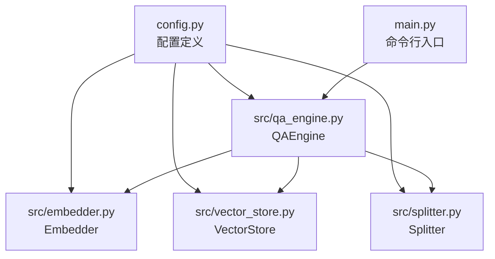
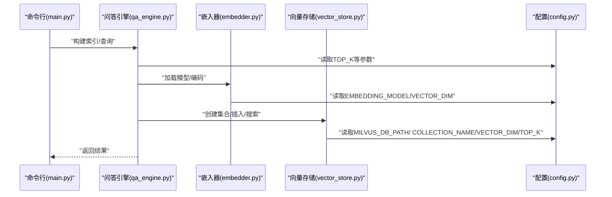
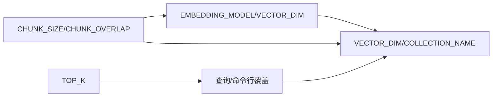

# 配置管理

<cite>
**本文引用的文件**
- [config.py](file://config.py)
- [embedder.py](file://src/embedder.py)
- [vector_store.py](file://src/vector_store.py)
- [splitter.py](file://src/splitter.py)
- [loader.py](file://src/loader.py)
- [qa_engine.py](file://src/qa_engine.py)
- [main.py](file://main.py)
- [requirements.txt](file://requirements.txt)
</cite>

## 目录
1. [简介](#简介)
2. [项目结构](#项目结构)
3. [核心组件](#核心组件)
4. [架构总览](#架构总览)
5. [详细组件分析](#详细组件分析)
6. [依赖关系分析](#依赖关系分析)
7. [性能考量](#性能考量)
8. [故障排查指南](#故障排查指南)
9. [结论](#结论)
10. [附录](#附录)

## 简介
本指南聚焦于配置管理部分，系统解析配置文件中的各项参数，涵盖嵌入模型设置、向量数据库参数、文本分割配置与检索性能调优，并结合实际代码实现说明各配置项的作用、默认值、相互影响与依赖关系。同时提供不同使用场景下的配置建议、验证与测试方法、配置迁移与版本兼容性指导，帮助用户根据自身需求定制最优配置。

## 项目结构
配置管理涉及的核心文件与模块如下：
- 配置定义：config.py
- 嵌入模型封装：src/embedder.py
- 向量存储封装（Milvus Lite）：src/vector_store.py
- 文本分割器（Markdown）：src/splitter.py
- 文档加载器：src/loader.py
- 问答引擎：src/qa_engine.py
- 命令行入口：main.py
- 依赖声明：requirements.txt

图表来源
- [config.py](file://config.py#L1-L24)
- [embedder.py](file://src/embedder.py#L1-L86)
- [vector_store.py](file://src/vector_store.py#L1-L172)
- [splitter.py](file://src/splitter.py#L1-L126)
- [qa_engine.py](file://src/qa_engine.py#L1-L119)
- [main.py](file://main.py#L1-L194)

章节来源
- [config.py](file://config.py#L1-L24)
- [embedder.py](file://src/embedder.py#L1-L86)
- [vector_store.py](file://src/vector_store.py#L1-L172)
- [splitter.py](file://src/splitter.py#L1-L126)
- [loader.py](file://src/loader.py#L1-L57)
- [qa_engine.py](file://src/qa_engine.py#L1-L119)
- [main.py](file://main.py#L1-L194)

## 核心组件
本节从配置角度梳理关键参数及其作用范围与默认值。

- 嵌入模型配置
  - EMBEDDING_MODEL：嵌入模型标识，用于初始化本地SentenceTransformer模型。默认值来自配置文件。
  - VECTOR_DIM：向量维度，与所选模型一致，用于向量集合创建时的维度匹配。
- Milvus 配置
  - MILVUS_DB_PATH：本地数据库文件路径，默认指向项目内 data 目录下的 Milvus Lite 文件。
  - COLLECTION_NAME：集合名称，默认为固定字符串。
- 文本分割配置
  - CHUNK_SIZE：分块大小（字符数），控制每块最大长度。
  - CHUNK_OVERLAP：分块重叠（字符数），用于保持上下文连续性。
- 检索配置
  - TOP_K：默认返回结果数量，用于问答查询时的检索上限。

章节来源
- [config.py](file://config.py#L5-L24)

## 架构总览
配置在系统中的传播路径如下：配置文件被多个模块导入，分别驱动嵌入编码、向量存储、文本分割与问答引擎的行为；命令行入口通过参数覆盖默认检索结果数量。

图表来源
- [main.py](file://main.py#L168-L175)
- [qa_engine.py](file://src/qa_engine.py#L10-L11)
- [embedder.py](file://src/embedder.py#L8)
- [vector_store.py](file://src/vector_store.py#L7)
- [config.py](file://config.py#L11-L23)

## 详细组件分析

### 嵌入模型设置
- 参数
  - EMBEDDING_MODEL：模型标识，决定编码器实例化与向量维度。
  - VECTOR_DIM：与模型输出维度一致，用于集合创建时的维度校验。
- 行为与依赖
  - 嵌入器在首次使用时加载模型；编码维度可通过接口查询，确保与配置一致。
  - 问答引擎在构建索引时会读取编码维度以创建集合。
- 推荐设置
  - 小规模文档：可选择较小模型以降低内存占用。
  - 大规模知识库：优先选择高维模型以提升检索精度。
  - 性能优化：在资源受限环境下，可考虑量化或更小模型，但需权衡精度。
- 验证方法
  - 通过嵌入器接口查询维度并与配置对比。
  - 构建索引时观察向量维度输出是否与配置一致。

章节来源
- [config.py](file://config.py#L11-L12)
- [embedder.py](file://src/embedder.py#L16-L68)
- [qa_engine.py](file://src/qa_engine.py#L53-L65)

### 向量数据库参数
- 参数
  - MILVUS_DB_PATH：本地数据库文件路径，用于 Milvus Lite 的持久化存储。
  - COLLECTION_NAME：集合名称，用于区分不同知识库。
  - VECTOR_DIM：集合维度，必须与嵌入模型输出维度一致。
  - TOP_K：默认检索返回数量。
- 行为与依赖
  - 向量存储在首次连接时创建客户端；集合创建时使用配置的维度与度量类型。
  - 搜索时使用配置的 TOP_K 作为默认返回数量。
- 推荐设置
  - 小规模文档：默认路径即可满足需求。
  - 大规模知识库：确保磁盘空间充足，必要时调整存储位置。
  - 性能优化：合理设置 TOP_K，避免过多结果导致检索变慢。
- 验证方法
  - 构建索引后检查集合统计信息，确认维度与记录数。
  - 查询时观察返回条目数量是否符合预期。

章节来源
- [config.py](file://config.py#L14-L23)
- [vector_store.py](file://src/vector_store.py#L15-L60)
- [vector_store.py](file://src/vector_store.py#L95-L128)
- [qa_engine.py](file://src/qa_engine.py#L58-L66)

### 文本分割配置
- 参数
  - CHUNK_SIZE：分块大小（字符数）。
  - CHUNK_OVERLAP：分块重叠（字符数）。
- 行为与依赖
  - 分割流程先按标题层级拆分，再按大小与句号等分隔符进行二次切分，最后保留非空块并分配索引。
  - 重叠有助于保持上下文连贯性，提高检索质量。
- 推荐设置
  - 小规模文档：适当增大重叠以增强上下文。
  - 大规模知识库：平衡 CHUNK_SIZE 与 CHUNK_OVERLAP，避免过度切分导致碎片化。
  - 性能优化：减小 CHUNK_SIZE 以降低单次编码负载，但需注意重叠带来的额外开销。
- 验证方法
  - 构建索引时观察生成的文本块数量与平均长度。
  - 查询时检查返回片段是否包含完整语义。

章节来源
- [config.py](file://config.py#L18-L20)
- [splitter.py](file://src/splitter.py#L10-L44)
- [splitter.py](file://src/splitter.py#L47-L85)
- [splitter.py](file://src/splitter.py#L88-L125)

### 检索配置
- 参数
  - TOP_K：默认返回结果数量。
- 行为与依赖
  - 命令行查询支持通过参数覆盖默认 TOP_K。
  - 问答引擎在查询时使用该参数限制返回结果数量。
- 推荐设置
  - 小规模文档：适度增大 TOP_K 以提升召回。
  - 大规模知识库：根据业务需求调整，兼顾准确率与响应速度。
  - 性能优化：减少 TOP_K 可显著降低向量检索与渲染开销。
- 验证方法
  - 命令行传参 --top-k 观察返回条目变化。
  - 统计页面显示当前索引状态与文档块数量。

章节来源
- [config.py](file://config.py#L22-L23)
- [main.py](file://main.py#L169-L175)
- [qa_engine.py](file://src/qa_engine.py#L75-L92)

## 依赖关系分析
配置项之间的耦合关系如下：
- 嵌入模型维度与向量集合维度必须一致，否则集合创建失败。
- 文本分割参数直接影响索引规模与检索质量。
- 检索参数影响用户体验与系统性能。
- 命令行入口允许覆盖默认检索参数。

图表来源
- [config.py](file://config.py#L11-L23)
- [embedder.py](file://src/embedder.py#L60-L68)
- [vector_store.py](file://src/vector_store.py#L35-L60)
- [splitter.py](file://src/splitter.py#L47-L85)
- [main.py](file://main.py#L169-L175)

章节来源
- [config.py](file://config.py#L11-L23)
- [embedder.py](file://src/embedder.py#L60-L68)
- [vector_store.py](file://src/vector_store.py#L35-L60)
- [splitter.py](file://src/splitter.py#L47-L85)
- [main.py](file://main.py#L169-L175)

## 性能考量
- 模型与维度
  - 更高维向量通常带来更好检索效果，但增加存储与计算开销。应根据硬件能力选择合适模型。
- 文本分割
  - 较大的 CHUNK_SIZE 减少分块数量，但可能丢失局部语义；较小 CHUNK_SIZE 提升定位精度但增加向量数量。
  - 重叠越大，上下文越完整，但会增加向量数量与存储压力。
- 检索
  - TOP_K 越大，召回越多，但检索与渲染成本越高。建议在生产环境按需下调。
- 存储
  - Milvus Lite 适合本地与小规模部署；大规模场景建议评估分布式向量数据库方案。

[本节为通用性能讨论，不直接分析具体文件]

## 故障排查指南
- 无法加载嵌入模型
  - 现象：初始化嵌入器时报错或加载缓慢。
  - 排查：确认模型标识正确且网络可访问；首次加载可能需要下载权重。
  - 参考
    - [embedder.py](file://src/embedder.py#L26-L34)
- 向量维度不匹配
  - 现象：创建集合失败或插入报错。
  - 排查：核对配置中的 VECTOR_DIM 与模型实际维度一致；构建索引时观察输出维度。
  - 参考
    - [config.py](file://config.py#L11-L12)
    - [embedder.py](file://src/embedder.py#L60-L68)
    - [vector_store.py](file://src/vector_store.py#L35-L60)
- 索引为空或查询无结果
  - 现象：统计显示索引为空，查询无命中。
  - 排查：确认已执行索引构建；检查文档目录是否存在；确认分割参数未导致过度切分。
  - 参考
    - [main.py](file://main.py#L60-L66)
    - [loader.py](file://src/loader.py#L10-L38)
    - [splitter.py](file://src/splitter.py#L88-L125)
- 检索结果过多或过少
  - 现象：返回条目不符合预期。
  - 排查：通过命令行参数覆盖 TOP_K；根据业务需求调整。
  - 参考
    - [main.py](file://main.py#L169-L175)
    - [config.py](file://config.py#L22-L23)

章节来源
- [embedder.py](file://src/embedder.py#L26-L34)
- [embedder.py](file://src/embedder.py#L60-L68)
- [vector_store.py](file://src/vector_store.py#L35-L60)
- [main.py](file://main.py#L60-L66)
- [loader.py](file://src/loader.py#L10-L38)
- [splitter.py](file://src/splitter.py#L88-L125)
- [config.py](file://config.py#L22-L23)

## 结论
配置管理是系统性能与效果的关键抓手。通过合理设置嵌入模型、向量维度、文本分割参数与检索返回数量，可在不同规模与场景下取得最佳平衡。建议在实际部署前进行基准测试，结合硬件条件与业务目标迭代优化配置。

[本节为总结性内容，不直接分析具体文件]

## 附录

### 不同使用场景下的配置建议
- 小规模文档（个人知识库）
  - 嵌入模型：选择中等维度模型，兼顾精度与资源消耗。
  - 文本分割：适当增大 CHUNK_OVERLAP 以增强上下文。
  - 检索：保持默认 TOP_K 或略增以提升召回。
- 大规模知识库（团队知识库）
  - 嵌入模型：优先高维模型以提升检索精度。
  - 文本分割：平衡 CHUNK_SIZE 与 CHUNK_OVERLAP，避免过度碎片化。
  - 检索：根据 SLA 调整 TOP_K，减少不必要的结果。
- 性能优化场景（资源受限）
  - 嵌入模型：选择较小模型或量化策略（若可行）。
  - 文本分割：减小 CHUNK_SIZE 并适度降低重叠。
  - 检索：降低 TOP_K，减少渲染与传输开销。

[本节为通用建议，不直接分析具体文件]

### 配置验证与测试方法
- 嵌入模型维度一致性
  - 步骤：初始化嵌入器并查询维度，与配置比对。
  - 参考
    - [embedder.py](file://src/embedder.py#L60-L68)
- 索引构建与统计
  - 步骤：执行索引构建，观察输出维度与文本块数量；使用统计命令查看集合状态。
  - 参考
    - [qa_engine.py](file://src/qa_engine.py#L53-L73)
    - [main.py](file://main.py#L125-L139)
- 检索行为验证
  - 步骤：在问答模式下输入问题，观察返回条目数量与相似度；通过命令行参数覆盖 TOP_K。
  - 参考
    - [main.py](file://main.py#L74-L92)
    - [config.py](file://config.py#L22-L23)

章节来源
- [embedder.py](file://src/embedder.py#L60-L68)
- [qa_engine.py](file://src/qa_engine.py#L53-L73)
- [main.py](file://main.py#L74-L92)
- [config.py](file://config.py#L22-L23)

### 配置迁移与版本兼容性指导
- 模型迁移
  - 当更换 EMBEDDING_MODEL 时，需重建索引以适配新的 VECTOR_DIM。
  - 参考
    - [config.py](file://config.py#L11-L12)
    - [vector_store.py](file://src/vector_store.py#L35-L60)
- 存储迁移
  - 更改 MILVUS_DB_PATH 时，确保新路径权限与空间充足；必要时迁移旧数据。
  - 参考
    - [config.py](file://config.py#L15)
    - [vector_store.py](file://src/vector_store.py#L15-L33)
- 参数演进
  - 修改 CHUNK_SIZE/CHUNK_OVERLAP/ TOP_K 后，建议重新评估索引质量与性能表现。
  - 参考
    - [config.py](file://config.py#L18-L23)
    - [splitter.py](file://src/splitter.py#L47-L85)
    - [main.py](file://main.py#L169-L175)

章节来源
- [config.py](file://config.py#L11-L23)
- [vector_store.py](file://src/vector_store.py#L15-L33)
- [splitter.py](file://src/splitter.py#L47-L85)
- [main.py](file://main.py#L169-L175)