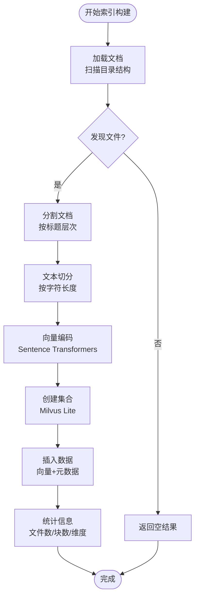

# 项目概述

<cite>
**本文引用的文件**
- [main.py](file://main.py)
- [config.py](file://config.py)
- [requirements.txt](file://requirements.txt)
- [src/qa_engine.py](file://src/qa_engine.py)
- [src/embedder.py](file://src/embedder.py)
- [src/vector_store.py](file://src/vector_store.py)
- [src/loader.py](file://src/loader.py)
- [src/splitter.py](file://src/splitter.py)
- [docs/python-guide.md](file://docs/python-guide.md)
- [docs/git-guide.md](file://docs/git-guide.md)
</cite>

## 目录
1. [简介](#简介)
2. [项目结构](#项目结构)
3. [核心组件](#核心组件)
4. [架构总览](#架构总览)
5. [详细组件分析](#详细组件分析)
6. [依赖关系分析](#依赖关系分析)
7. [性能考量](#性能考量)
8. [故障排查指南](#故障排查指南)
9. [结论](#结论)
10. [附录](#附录)

## 简介
本项目是一个基于 Milvus Lite 的本地语义检索知识库系统，旨在为用户提供无需网络即可运行的文档语义检索能力。通过将 Markdown 文档转换为向量并存储在本地向量数据库中，系统支持对自然语言问题进行语义匹配，从而实现更准确、更灵活的知识检索体验。

### 核心价值与目标
- **本地化部署**：完全在本地运行，保护隐私数据安全
- **语义理解**：超越关键词匹配，理解文档的真实含义
- **易用性**：提供简洁的命令行界面，降低使用门槛
- **可扩展性**：模块化设计，便于功能扩展和定制

### 主要功能特性
- **文档索引构建**：自动扫描并索引 Markdown 文档，生成语义向量
- **语义检索**：基于余弦相似度的向量检索，支持 Top-K 结果返回
- **交互式问答**：提供持续对话式的问答体验
- **统计监控**：实时查看知识库状态和统计信息

### 技术架构概览
系统采用分层架构设计，包含以下核心层次：
- **应用层**：命令行界面，提供用户交互入口
- **业务逻辑层**：问答引擎，协调各组件完成完整流程
- **数据处理层**：文档加载、文本分割、向量生成
- **存储层**：Milvus Lite 本地向量数据库

### 适用场景与目标用户
- **个人知识管理**：整理和检索个人文档、笔记
- **团队知识库**：构建团队内部文档检索系统
- **技术文档检索**：快速定位技术文档中的相关信息
- **学习资料整理**：构建学习材料的语义检索系统

## 项目结构
项目采用模块化组织方式，主要文件结构如下：


**图表来源**
- [main.py](file://main.py#L1-L194)
- [config.py](file://config.py#L1-L24)
- [src/qa_engine.py](file://src/qa_engine.py#L1-L119)

**章节来源**
- [main.py](file://main.py#L1-L194)
- [config.py](file://config.py#L1-L24)

## 核心组件
系统由五个核心组件构成，每个组件都有明确的职责分工：

### 问答引擎 (QAEngine)
作为系统的核心协调者，负责编排整个索引构建和查询流程。它整合了文档加载、文本分割、向量生成和向量检索等所有功能。

### 嵌入模型 (Embedder)
封装了 Sentence Transformers 模型，提供文本到向量的转换能力。支持延迟加载机制，优化启动性能。

### 向量存储 (VectorStore)
基于 Milvus Lite 的本地向量数据库封装，提供集合管理、数据插入、相似度搜索和统计查询功能。

### 文档加载器 (Loader)
专门处理 Markdown 文件的递归扫描和读取，支持多层级目录结构。

### 文本分割器 (Splitter)
针对 Markdown 格式进行智能分割，既按标题层次分割，又按字符长度进行细粒度切分。

**章节来源**
- [src/qa_engine.py](file://src/qa_engine.py#L13-L119)
- [src/embedder.py](file://src/embedder.py#L11-L86)
- [src/vector_store.py](file://src/vector_store.py#L10-L172)
- [src/loader.py](file://src/loader.py#L10-L57)
- [src/splitter.py](file://src/splitter.py#L10-L126)

## 架构总览
系统采用分层架构，体现了清晰的关注点分离：


**图表来源**
- [main.py](file://main.py#L142-L194)
- [src/qa_engine.py](file://src/qa_engine.py#L13-L119)
- [src/embedder.py](file://src/embedder.py#L11-L86)
- [src/vector_store.py](file://src/vector_store.py#L10-L172)

## 详细组件分析

### 命令行界面设计
系统提供了三个核心命令，每个命令都有明确的功能定位：


**图表来源**
- [main.py](file://main.py#L24-L123)
- [src/qa_engine.py](file://src/qa_engine.py#L25-L92)

### 索引构建流程
索引构建是系统的核心流程，包含多个处理阶段：



**图表来源**
- [src/qa_engine.py](file://src/qa_engine.py#L25-L73)
- [src/loader.py](file://src/loader.py#L10-L38)
- [src/splitter.py](file://src/splitter.py#L88-L125)

### 查询处理流程
查询处理流程体现了语义检索的核心能力：


**图表来源**
- [src/qa_engine.py](file://src/qa_engine.py#L75-L92)
- [src/vector_store.py](file://src/vector_store.py#L95-L128)

**章节来源**
- [main.py](file://main.py#L24-L123)
- [src/qa_engine.py](file://src/qa_engine.py#L25-L101)

## 依赖关系分析
系统依赖关系清晰，体现了良好的模块化设计：


**图表来源**
- [requirements.txt](file://requirements.txt#L1-L6)
- [main.py](file://main.py#L17-L18)
- [src/qa_engine.py](file://src/qa_engine.py#L5-L10)

**章节来源**
- [requirements.txt](file://requirements.txt#L1-L6)
- [config.py](file://config.py#L1-L24)

## 性能考量
系统在多个层面考虑了性能优化：

### 向量维度选择
- **768维向量**：平衡了精度和性能，适合大多数应用场景
- **可配置性**：支持不同模型的切换，满足不同需求

### 文本分割策略
- **层次化分割**：先按标题层次分割，保持语义完整性
- **重叠机制**：避免跨块信息丢失
- **字符边界**：在句子边界处进行分割，提高可读性

### 缓存与延迟加载
- **模型延迟加载**：首次使用时才加载嵌入模型
- **连接复用**：向量存储客户端连接复用，减少开销

## 故障排查指南
常见问题及解决方案：

### 索引构建失败
- **检查文档目录**：确保路径存在且包含 Markdown 文件
- **验证模型加载**：确认 Sentence Transformers 模型可正常加载
- **磁盘空间**：确保有足够的磁盘空间存储向量数据

### 查询无结果
- **确认索引状态**：使用 `stats` 命令检查索引是否已建立
- **调整相似度阈值**：根据实际需求调整返回结果数量
- **检查向量维度**：确保查询向量维度与索引一致

### 性能问题
- **优化文本分割**：适当调整分块大小和重叠比例
- **硬件要求**：确保有足够的内存和 CPU 资源
- **模型选择**：根据性能需求选择合适的嵌入模型

**章节来源**
- [main.py](file://main.py#L30-L51)
- [src/qa_engine.py](file://src/qa_engine.py#L94-L101)

## 结论
本项目成功实现了基于 Milvus Lite 的本地语义检索知识库系统，具有以下优势：

- **技术先进性**：采用最新的向量数据库技术和嵌入模型
- **用户体验**：简洁直观的命令行界面，易于使用
- **可扩展性**：模块化设计，便于功能扩展和定制
- **本地化部署**：保护数据隐私，适合企业级应用

系统为个人和团队提供了强大的文档检索能力，能够显著提升知识管理和信息检索效率。

## 附录

### 快速开始指南
1. **环境准备**
   - 安装 Python 3.7+
   - 准备 Markdown 文档目录

2. **安装依赖**
   ```bash
   pip install -r requirements.txt
   ```

3. **建立索引**
   ```bash
   python main.py index --docs-dir ./docs
   ```

4. **开始问答**
   ```bash
   python main.py query
   ```

5. **查看统计**
   ```bash
   python main.py stats
   ```

### 配置选项
- **嵌入模型**：支持多种预训练模型，可按需选择
- **分块参数**：可调整分块大小和重叠比例
- **检索参数**：可设置返回结果数量

### 开发者指南
- **扩展新功能**：通过添加新的模块来扩展系统能力
- **自定义模型**：支持加载自定义的嵌入模型
- **集成第三方**：可与其他系统进行集成

**章节来源**
- [docs/python-guide.md](file://docs/python-guide.md#L1-L120)
- [docs/git-guide.md](file://docs/git-guide.md#L1-L151)